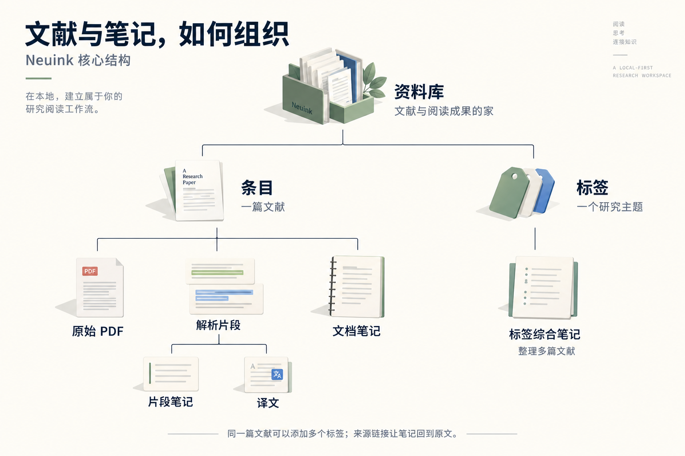
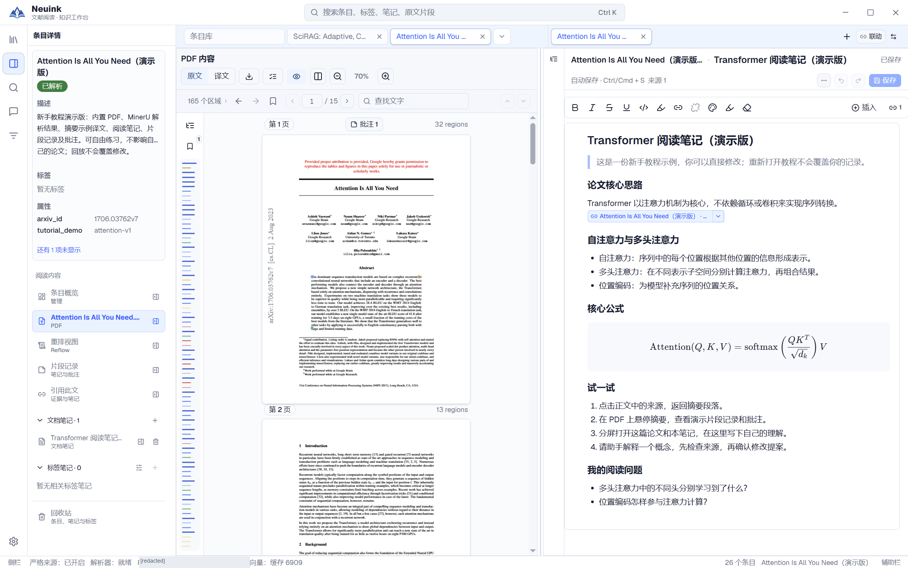

<p align="center">
  
</p>

<h1 align="center">Neuink</h1>

<p align="center">
  <strong>简体中文</strong> · <a href="README_EN.md">English</a>
</p>

<p align="center">
  <a href="https://github.com/SugrSertraline/neuink">GitHub Repository</a>
</p>

<p align="center">
  <strong>让每一次阅读，都留下可追溯的理解。</strong><br>
  本地优先的文献阅读、证据笔记与 AI 研究工作台。
</p>

<p align="center">
  
  
  
  
  <a href="https://linux.do"></a>
</p>

> **Neuink** 面向论文、报告、标准和书籍章节，把资料整理、PDF 与网页阅读、跨篇对照、来源笔记、检索和 AI 研究放进同一个本地工作区。阅读成果可以回到原文证据，也可以导出为独立文件。

**整理资料 → 阅读与对照 → 记录并连接证据 → 检索与研究 → 导出分享**

[产品官网](https://sugrsertraline.github.io/neuink/) · [作者主页](https://sugrsertraline.github.io/homepage/) · [核心功能](#核心功能) · [开始使用](#开始使用) · [本地与在线能力](#本地与在线能力) · [开发与构建](#开发与构建) · [项目文档](#项目文档)

## macOS 预览构建

[自动构建](https://github.com/SugrSertraline/neuink/actions/workflows/windows-portable.yml) 已配置 Apple Silicon 和 Intel 两种 Mac runner，云端成功后分别提供 `Neuink-macos-arm64.app.zip` 与 `Neuink-macos-x64.app.zip`。解压后将 `Neuink.app` 移到“应用程序”，embedding 随包提供，用户资料另存于系统数据目录。

目前仅 ad-hoc 签名、未 Apple 公证，也未完成 Mac 实机验收；Gatekeeper 可能阻止运行，不建议关闭系统安全防护。Windows 专用内嵌网页及视频字幕运行时尚未移植，Mac 暂按预览版提供，不视为功能完全对等的正式版。详见 [打包与发行](docs/deployment/packaging-and-distribution.md)。

## 完整功能介绍与使用手册

README 提供概览，详细用法收录于 [22 篇专题手册](website/README.md)。现已发布到 GitHub Pages，可通过 **[Neuink 产品与使用指南](https://sugrsertraline.github.io/neuink/)** 阅读，含功能导航、章节全文搜索、手机目录和完整研究流程。

| 想了解什么 | 对应说明 |
| --- | --- |
| 先看实际界面 | [实机界面图解](website/content/screenshots.md)：阅读、翻译、分屏笔记和助手 |
| 安装、资料库、侧栏与分屏 | [第一次使用](website/content/start.md) · [认识工作台](website/content/workspace.md) |
| 条目、标签、属性与解析 | [资料整理](website/content/library.md) · [MinerU 导入](website/content/import.md) |
| PDF、书页模式、重排、翻译与多篇对照 | [PDF](website/content/pdf.md) · [重排](website/content/reflow.md) · [翻译](website/content/translation.md) · [标签阅读](website/content/parallel.md) |
| 笔记、批注、收藏、来源与关系图 | [记录方式](website/content/notes.md) · [来源追溯](website/content/sources.md) · [关系图](website/content/graph.md) |
| 本地搜索、AI、在线文献和网页 | [搜索](website/content/search.md) · [助手](website/content/assistant.md) · [在线研究](website/content/research.md) · [网页与字幕](website/content/browser.md) |
| 分享、设置、迁移与问题排查 | [导出](website/content/export.md) · [设置](website/content/settings.md) · [数据](website/content/data.md) · [研究流程](website/content/workflows.md) · [常见问题](website/content/faq.md) |

## 核心概念



[查看概念关系与实例](https://sugrsertraline.github.io/neuink/concepts.html) · [按流程开始使用](https://sugrsertraline.github.io/neuink/start.html)

| 概念 | 它是什么 | 什么时候用 |
| --- | --- | --- |
| 资料库（Workspace） | 保存在本地的一组文献与阅读成果。 | 按长期研究方向管理自己的资料。 |
| 条目（Entry） | 一篇文献的管理单位，包含标题、PDF、解析结果及相关笔记。 | 导入论文、补充属性、管理文件。 |
| 标签（Tag） | 可有父子层级的主题分类，一篇文献可属于多个标签。 | 汇集同一主题的论文，进行跨篇阅读。 |
| 片段（Segment） | 解析得到的段落、表格、公式或图片等内容单元。 | 定位证据、翻译某段、记录局部想法。 |
| 笔记（Note） | 文档笔记整理单篇论文，标签综合笔记整理跨篇主题。 | 把阅读转化成自己的理解。 |
| 来源链接（Source Link） | 将笔记连接到文献、页码、片段及引用快照。 | 检查某个结论的依据，返回原文核对。 |

## 核心功能

### 1. 资料库：按研究主题组织文献

- 创建条目、导入或批量拖入 PDF，维护标题、描述、层级标签和自定义属性；使用列表或书架浏览资料。
- 从 MinerU 客户端导入解析结果 ZIP，或连接自建 MinerU 兼容服务；解析队列展示等待、进行中和失败状态，并支持重试。
- 按标签及其后代组织阅读范围，查看阅读进度、页码和笔记；条目、笔记及标签的删除与恢复使用相应回收站入口。
- 在关系图中查看标签层级、论文归属、笔记归属和来源引用，搜索、筛选并打开关联内容。图中的关系来自已有数据，不代表自动发现的学术引用网络。

### 2. 阅读工作台：原文、重排与多篇对照

- **PDF 原文**：保留原始版式，支持目录、缩放、片段定位、悬停预览、批注和片段笔记。未解析的 PDF 也可直接阅读。
- **Reflow 重排**：阅读解析后的段落、列表、公式、表格和图片，在原图与解析内容之间按需切换。
- **翻译与对照**：配置翻译模型后，可翻译选区、片段或全文，查看原文与译文；全文任务支持暂停、继续、取消和失败重试。
- **标签平行阅读**：从同一主题的论文列表打开当前论文与右侧对照；两侧独立阅读，配合文档笔记或标签综合笔记整理多篇材料。
- **多标签与分屏**：PDF、重排、笔记、助手完整回复和网页可在工作区中切换；支持标签排序、固定和左右分屏。实时任务面板集中显示解析、翻译、论文添加和助手任务。

### 3. 证据笔记：让结论能回到出处

- 使用 Markdown 编辑器编写文档笔记和标签综合笔记，支持目录、表格、图片、代码、数学公式及 Mermaid 图表。
- 将阅读中的想法保存为片段笔记或批注，使用 Source Link 连接条目、页码、片段和文本快照。
- 在笔记中预览来源、跳回原文、查看反向引用；文档笔记的 Markdown 导出保留可读来源脚注。
- 保存、关闭、跨分屏移动与切换资料库均接入未保存内容保护；已有内容变化时检查冲突。

### 4. 检索与 AI 研究：从资料中找答案，继续寻找文献

- **本地搜索**：关键词搜索覆盖条目、标签、字段、文档笔记、片段笔记、PDF 页面和解析片段；配置本地 embedding 资源后可使用语义与混合搜索。模型缺失或不可用时明确提示降级。
- **带上下文的助手**：关联当前阅读对象，或用 `@` 附加条目、标签、笔记与片段；也可取消内容关联。对话保留来源、工具过程和提案状态。
- **可审查的修改**：助手修改文档笔记、标签或元数据时先提出 Proposal，展示修改预览，经你确认后应用。标签综合笔记的通用 Agent 写入仍未接通。
- **在线研究**：内置论文搜索、网页搜索和正文读取；按配置使用 arXiv、Crossref、OpenAlex，以及可选 Tavily、Sciverse。候选论文由用户确认后添加，明确区分 PDF 入库和仅元数据结果。
- **模型配置**：支持 OpenAI-compatible、Anthropic 和 Google 协议，可为助手与翻译分别指定模型。

### 5. 网页阅读：把外部材料带入当前研究

Windows 原生应用支持内嵌网页标签、地址栏、前进后退、独立缩放和分屏，最多同时打开 8 个网页。将网页关联为当前阅读对象后，可以让助手按需读取正文或选区，整理为待确认的文档笔记。

| 内容 | 当前读取范围 |
| :--- | :--- |
| 普通网页 | 提取已加载页面的正文；非文章页面回退到有界可见文字。 |
| 公开 PDF | 提取文字，默认前 8 页，可指定每次 1–20 页；显示实际覆盖范围，不自动 OCR 或导入资料库。 |
| YouTube／哔哩哔哩具体视频 | 读取公开简介和可用中英文字幕；无字幕或受限时明确说明，不代表已分析画面和声音。 |

打开网页不会自动把正文发送给模型。公开 PDF／视频读取可能重新请求资源，不携带浏览器 cookies。内嵌网页和视频运行时存在平台限制，详见下方说明。

### 6. 导出分享：把阅读成果带出工作区

| 导出对象 | 已支持格式与范围 |
| :--- | :--- |
| 解析全文、中文译稿、双语稿 | DOCX、TXT、含图片的 Markdown ZIP；支持内容检查及缺失项预览。 |
| 当前论文的文档笔记、片段笔记、批注、译文片段 | 选择项目后合并为 DOCX／TXT，或逐项打包为 DOCX／TXT ZIP。 |
| 文档笔记 Markdown | 另存为本地 MD，保留可读来源脚注。 |

导出读取已保存的完整数据，不受阅读界面折叠或虚拟滚动范围影响。未译、失效译文或缺图会列出，允许确认后导出带说明的草稿。Word 输出保留内容结构，不承诺复刻 PDF 原始排版；中文 PDF、带批注 PDF 和 PPTX 仍不是当前导出能力。

## 界面示例

通过[图文使用指南](https://sugrsertraline.github.io/neuink/screenshots.html)了解系统概念、功能入口和完整操作流程。下图展示 PDF 与来源笔记的分屏工作台。




## 开始使用

### 已有 Windows 便携包

完整解压后双击 `Neuink.exe`，保留随包资源目录。无需安装 Node.js 或 Rust，系统需有 Microsoft Edge WebView2 Runtime。便携包沿用应用的资料库与设置位置，用户数据不一定存放在 EXE 旁边。

当前项目版本为 **0.1.0**。Windows 提供便携包构建流程；签名、应用内自动更新及原生发行验收仍有待完成。自动构建、下载方式和各平台验收状态见[打包与发行](docs/deployment/packaging-and-distribution.md)。

### 第一次整理一篇论文

1. **创建或打开资料库**：在设置的“资料库与数据”中选择本地 Workspace；新手引导可带你熟悉主要入口，离线演示取决于安装包是否包含演示素材。
2. **导入材料**：直接导入 PDF 即可阅读。需要结构化内容时，在“导入与解析”中查看 MinerU 客户端图文教程：先解析，再导出完整结果并压缩为 ZIP，最后导入 Neuink。
3. **整理与阅读**：添加主题标签，打开 PDF 或 Reflow；需要对照时，从同标签论文列表打开另一篇。
4. **记录证据**：新建文档笔记或标签综合笔记，插入来源链接并保存。
5. **按需启用 AI**：在模型设置中建立连接，为助手和翻译指定模型；选择阅读范围后提问，审阅修改提案。
6. **导出成果**：从 PDF／Reflow 的导出入口生成全文或译稿，从文档笔记或条目概览导出所选阅读成果。

**MinerU ZIP 要求**：包含 `content_list_v2.json` 或兼容的 `content_list.json`，以及正文引用的图片。用 ZIP 创建新条目还需附原 PDF；导入已有 PDF 条目时不必重复附带。此路径无需在 Neuink 配置解析服务 URL 或 API Key。

也可在“自建 MinerU 服务”中配置 URL 和可选 API Key。导入 PDF 后自动解析默认关闭，需主动开启；解析服务与 LLM 配置相互独立。

## 本地与在线能力

| 能力 | 依赖与数据范围 |
| :--- | :--- |
| 资料管理、PDF／已解析内容阅读、笔记、关键词搜索、已保存成果导出 | 本地完成，不依赖 LLM 或在线解析服务。 |
| 语义／混合搜索 | 需要本地 embedding 资源；不在运行时静默下载模型。 |
| PDF 结构化解析 | 导入已有 MinerU ZIP，或把 PDF 发给自己配置的兼容解析服务。 |
| AI 对话与翻译 | 使用自行配置的模型服务；相关上下文会发送至该服务。 |
| 在线论文／网页研究 | 需要网络；可选服务还受凭据、权限和配额限制。 |
| 内嵌网页／视频字幕读取 | 原生网页目前在 Windows 启用；视频运行时当前随 Windows x64 包提供。 |

Workspace 是普通本地文件夹，保存 PDF、笔记、批注、标签、译文和会话；搜索等缓存可重建。API Key 不属于 Workspace 或分享包。迁移资料库会复制、验证并保留原目录。

**当前边界**：本地关系图展示已有关系；自动研究方向图、证据对比表、跨原生窗口拖出和团队云协作不在本文已实现能力之列。具体完成度与后续工作统一见[开发计划](docs/development/dev-plan.md)。

## 开发与构建

### 从源码运行

需要 Node.js、npm、Rust stable 及 [Tauri 2 平台前置依赖](https://v2.tauri.app/start/prerequisites/)。在仓库根目录执行：

```powershell
npm install
npm run desktop:dev
```

基础阅读和笔记无需 `.env`、LLM 或 embedding 模型。解析服务和模型在应用设置中配置；`.env.example` 仅提供可选的旧 MinerU 地址列表配置，不是 MinerU Cloud Token 模板。

<details>
<summary>可选：启用本地语义搜索</summary>

将 FastEmbed 兼容的 `intfloat/multilingual-e5-small` 资源置于：

```text
apps/desktop/src-tauri/resources/embedding-models/default/
```

所需文件见[模型目录说明](apps/desktop/src-tauri/resources/embedding-models/default/README.md)。实际模型文件被 Git 忽略，资源齐备后重启应用。没有模型仍可运行应用和关键词搜索。

</details>

<details>
<summary>Windows x64：准备网页／视频读取组件</summary>

```powershell
npm --workspace apps/desktop run prepare:browser-reader
npm --workspace apps/desktop run verify:browser-reader
```

准备命令显式下载并校验固定版本的 Python、yt-dlp、EJS 和 QuickJS-NG，不要求用户另装 Python。版本、来源与 SHA256 由[资源锁定清单](apps/desktop/scripts/browser-reader-lock.json)维护；正常运行不自动下载安装。缺资源时开发模式警告，Windows x64 发行构建失败。读取范围和资源分发规则见[打包说明](docs/deployment/packaging-and-distribution.md#网页内容读取组件)。

</details>

### 验证与打包

```powershell
# TypeScript 检查与前端构建
npm run desktop:build

# Rust 检查、Rust 测试、前端测试
npm run check
npm run test
npm --workspace apps/desktop run test:frontend

# Windows x64 发行前准备并验证读取运行时
npm --workspace apps/desktop run prepare:browser-reader
npm --workspace apps/desktop run verify:browser-reader

# 构建原生 Tauri bundle
npm --workspace apps/desktop run tauri -- build

# 或构建 Windows 便携 ZIP
npm run desktop:release:portable
```

便携包输出为 `release/Neuink-portable-<timestamp>.zip`，当前流程还要求本地 embedding 资源完整，不打包本机 `.env` 凭据。可选教程素材缺失不阻止普通构建。

`desktop:build` 只构建前端，不会更新独立桌面程序；`desktop:dev` 和调试程序依赖本地前端服务。体验最新独立版本需重新构建原生 bundle 或便携包。

## 项目文档

```text
apps/desktop/   Tauri 桌面壳、React UI 与打包脚本
crates/         Rust 领域、Workspace、解析、搜索、任务、配置、研究接入与 IPC
docs/           产品、架构、工程规范、回归与发行文档
```

- [文档索引](docs/README.md)：查找长期维护文档。
- [产品需求](docs/product/01-prd.md)：产品定位与需求边界。
- [系统架构](docs/architecture/system-architecture.md)：当前模块、数据与写盘约束。
- [开发计划](docs/development/dev-plan.md)：已实现内容、待验收项与后续路线。
- [工程规范](docs/development/engineering-guidelines.md) · [UI 设计与交互规范](docs/development/ui-design-system.md) · [系统测试用例](docs/development/system-test-cases.md)。

## 开源组件与许可证

Neuink 自身采用 [Apache License 2.0](LICENSE)。项目使用下列主要直接依赖；它们各自的许可证与声明在分发构建产物时仍然有效。

| 组件 | 在 Neuink 中的作用 | 许可证 |
| :--- | :--- | :--- |
| [Tauri](https://tauri.app/) 与 Tauri Plugins | 桌面运行时、原生对话框、HTTP | Apache-2.0 OR MIT |
| [React](https://react.dev/)、[Vite](https://vite.dev/)、[Tailwind CSS](https://tailwindcss.com/) | 用户界面与构建工具 | MIT |
| [PDF.js](https://mozilla.github.io/pdf.js/) | PDF 渲染与文字提取 | Apache-2.0，字体／CMap／WASM 保留各自声明 |
| [Mozilla Readability](https://github.com/mozilla/readability) | 已加载网页正文提取，固定 0.6.0 原始源码 | Apache-2.0 |
| [yt-dlp](https://github.com/yt-dlp/yt-dlp)／[EJS](https://github.com/yt-dlp/ejs) | 公开视频字幕及元信息 | Unlicense；EJS 捆绑组件另含 MIT／ISC |
| [CPython](https://www.python.org/)／[QuickJS-NG](https://github.com/quickjs-ng/quickjs) | 隔离媒体读取运行时 | PSF 及随附组件许可／MIT 及随附组件许可 |
| [subtp](https://crates.io/crates/subtp) | SRT／WebVTT 字幕语法解析 | MIT OR Apache-2.0 |
| [TipTap](https://tiptap.dev/)、[KaTeX](https://katex.org/)、[Mermaid](https://mermaid.js.org/) | Markdown 编辑、数学公式、图表 | MIT |
| [assistant-ui](https://www.assistant-ui.com/) | AI 对话界面 | MIT |
| [Vercel AI SDK](https://ai-sdk.dev/) 与 `@ai-sdk/openai-compatible` | 模型服务接入与流式响应 | Apache-2.0 |
| [FastEmbed](https://crates.io/crates/fastembed)、[Tokio](https://tokio.rs/)、[Reqwest](https://crates.io/crates/reqwest)、[Serde](https://serde.rs/)、[Rayon](https://github.com/rayon-rs/rayon) | 本地 embedding、异步、网络、序列化与并行搜索 | Apache-2.0、MIT 或 MIT OR Apache-2.0（以各 crate 声明为准） |
| [`intfloat/multilingual-e5-small`](https://huggingface.co/intfloat/multilingual-e5-small) | 可选本地 embedding 模型 | MIT |
| [MinerU](https://github.com/opendatalab/MinerU) | 可选 PDF 解析集成，不随本仓库分发 | MinerU Open Source License（基于 Apache-2.0，含附加条款） |

这是主要组件的可读摘要，不替代完整的第三方声明。精确的解析版本分别锁定在 [`package-lock.json`](package-lock.json) 与 [`Cargo.lock`](Cargo.lock)。发布安装包前，请为所有已解析的 npm / Cargo 依赖生成完整 notices，并复核任何一并分发的模型文件和外部服务条款。

媒体运行时另由 `apps/desktop/scripts/browser-reader-lock.json` 锁定官方来源和 SHA256，使用 PyPI wheel 而不是含额外 GPL 组件的官方 yt-dlp.exe。原始许可证与第三方声明随运行时保留；Readability、PDF.js 和 subtp 的声明随 `resources/reader-licenses` 分发。上游源码未改写，Neuink 仅负责目标授权、调度、输出整理及资源清理。

## License

Neuink is licensed under [Apache-2.0](LICENSE). Third-party component guidance is available in [NOTICE](NOTICE).
