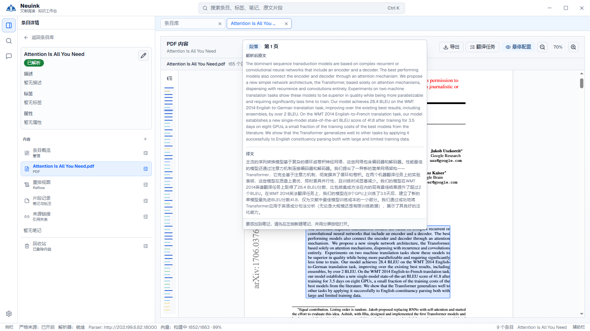
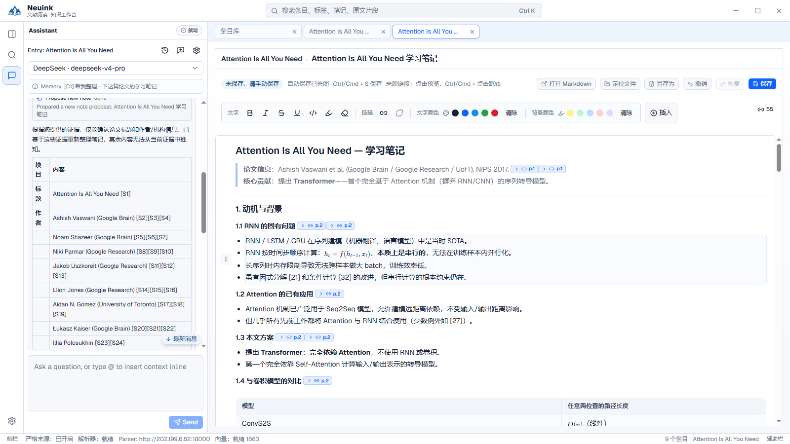
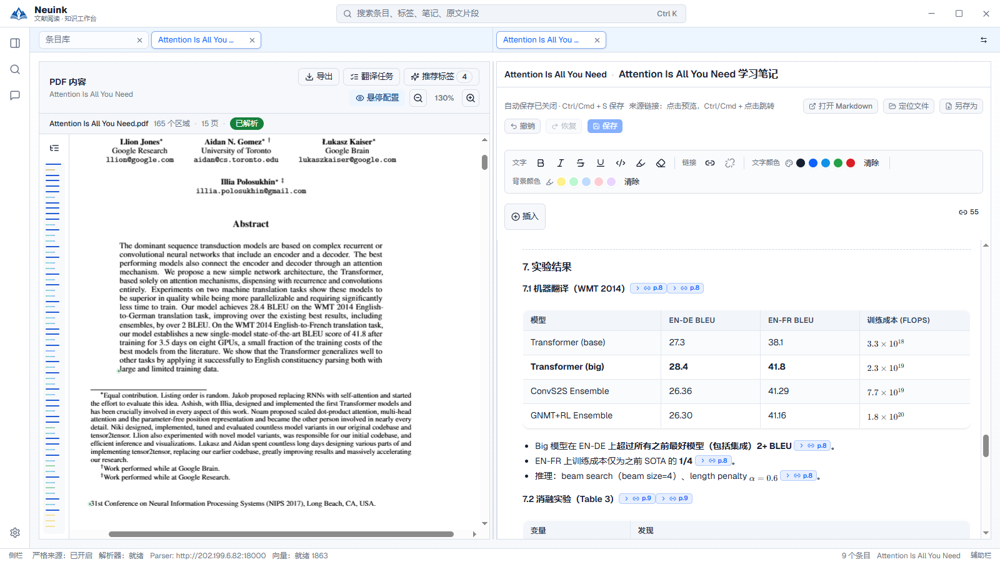

<p align="center">
  
</p>

<h1 align="center">Neuink</h1>

<p align="center">
  <a href="README.md">简体中文</a> · <strong>English</strong>
</p>

<p align="center">
  <a href="https://github.com/SugrSertraline/neuink">GitHub Repository</a>
</p>

<p align="center">
  <strong>Make every reading insight traceable.</strong><br>
  A local-first workspace for reading, thinking, and building knowledge from PDFs.
</p>

<p align="center">
  
  
  
  
  <a href="https://linux.do"></a>
</p>

<p align="center">
  
</p>

> **Neuink** is a local-first knowledge workspace for papers, reports, standards, and book chapters. It brings PDF reading, structured parsing, notes, search, and AI collaboration into one Workspace—while keeping every conclusion connected to its original evidence.

## From PDF to verifiable understanding

```text
Import material  →  Parse structure  →  Read and annotate  →  Connect notes to sources  →  Search, ask, and retain
```

Neuink treats literature work as more than finishing a file. It turns pages, paragraphs, tables, and formulas into locatable context; connects notes with evidence; and uses search and AI collaboration to turn scattered reading into knowledge you can revisit and reuse.

| Original and structured reading | Evidence-linked notes | Local search and AI collaboration |
| :--- | :--- | :--- |
| Switch between the original PDF layout and a Reflow view; locate headings, paragraphs, lists, formulas, tables, and visual blocks. | Write in Markdown and insert Source Links that can expand, jump to evidence, and export as readable footnotes. | Search entries, tags, fields, notes, pages, and segments; use explicit context to receive source-linked answers. |

## A visible workflow

<table>
  <tr>
    <td width="50%" valign="top">
      
      <br /><br />
      <strong>Write inside the context</strong><br />
      The AI assistant, source links, and Markdown editor share one workspace. The assistant reads only explicitly selected context, and note or metadata changes are first presented as proposals for you to apply.
    </td>
    <td width="50%" valign="top">
      
      <br /><br />
      <strong>Keep the source beside your thinking</strong><br />
      Keep the original PDF layout and segment navigation on the left while building notes on the right. Key claims can retain their page and segment path back to the evidence.
    </td>
  </tr>
</table>

## Core capabilities

### Read deeply, not just faster

- Import PDFs, monitor parsing, retry failures, and retain both the original PDF and normalized Source Segments.
- Read original layouts with PDF.js, hover previews, segment navigation, contextual actions, and source panels.
- Use Reflow for parsed prose, lists, formulas, tables, and visual content; run full-text translation, pause, retry, or export when needed.

### Turn notes into an evidence network

- Use the TipTap Markdown editor for headings, lists, quotations, code, mathematics, images, callouts, and tables.
- Structure notes with annotations, tags, and custom fields; a Source Link retains the entry, page, segment, and text snapshot.
- Preview the source from a note, jump back to the PDF, inspect backlinks, and retain readable footnotes in exported Markdown.

### Search and collaborate across a local library

- Keyword search spans entries, tags, fields, Markdown Notes, Segment Notes, PDF pages, and PDF Segments.
- With the optional local embedding model, Semantic and Hybrid modes are available. When it is unavailable, Neuink states this clearly and falls back instead of presenting keyword results as semantic ones.
- AI conversations use explicit `@` context, workspace search, and source links. Tool traces, conversations, and proposal state are saved to the Workspace.

## Local-first, without giving up extensibility

| Local by default | Bring your own services | You keep control |
| :--- | :--- | :--- |
| A Workspace is an ordinary local folder and the source of truth for PDFs, notes, tags, conversations, and derived files. Reading, editing, and keyword search work without a network connection. | Parsing can connect to MinerU Cloud or a compatible custom endpoint; you choose and configure your AI model service. | API keys are not written into Workspace data or exports; caches are rebuildable; AI changes are never silently written and require you to apply a proposal. |

### MinerU, models, and service boundaries

- **MinerU**: Neuink integrates MinerU Cloud and compatible parser endpoints to turn PDFs into structured results for Reflow, segment navigation, and source links. MinerU is an optional external parsing capability; it is not bundled with this repository or the primary application. When using a cloud service, review its terms and data-handling policy yourself.
- **Local semantic model**: Semantic and Hybrid search use optional local resources compatible with `intfloat/multilingual-e5-small`. The files are large, ignored by Git, and never downloaded silently at runtime. Neuink remains usable without the model; semantic search is simply unavailable.
- **LLMs**: Neuink does not ship a large language model. Configure your own model service in Settings; basic reading, notes, and keyword search do not depend on an LLM.

## Quick start

### Requirements

- Node.js and npm
- Rust stable and the [Tauri 2 platform prerequisites](https://v2.tauri.app/start/prerequisites/)
- A MinerU Cloud token or compatible parser endpoint only when PDF parsing is needed
- An LLM profile only when AI collaboration is needed

```powershell
npm install
npm run desktop:dev
```

On first launch, create or open a local Workspace. Basic reading, notes, and keyword search work even without `.env`, an embedding model, or an LLM.

<details>
<summary><strong>Optional: configure MinerU Cloud</strong></summary>

Copy the template and fill in only what you need. Never commit a real `.env` file or API key.

```powershell
Copy-Item .env.example .env
```

</details>

<details>
<summary><strong>Optional: enable local semantic search</strong></summary>

Place compatible `intfloat/multilingual-e5-small` resources in:

```text
apps/desktop/src-tauri/resources/embedding-models/default/
```

The model directory is protected by Git ignore rules. Before distributing an application with the model, verify its licence, file integrity, and actual load behaviour.

</details>

## Build and verify

```powershell
# Type-check and build the frontend
npm run desktop:build

# Rust checks, Rust tests, and frontend tests
npm run check
npm run test
npm --workspace apps/desktop run test:frontend

# Build the native Tauri bundle
npm --workspace apps/desktop run tauri -- build
```

Build a portable Windows ZIP:

```powershell
npm run desktop:release:portable
```

The command outputs `release/Neuink-portable-<timestamp>.zip` and includes only `.env.example`, never your local `.env` credentials. The current portable flow requires local embedding resources.

## Project layout

```text
apps/desktop/   Tauri desktop shell, React UI, and packaging scripts
crates/         Rust domain, Workspace, parser, search, job, config, and IPC crates
docs/           Product, architecture, engineering, regression, and release docs
```

Start with the [documentation index](docs/README.md), then see the [product requirements](docs/product/01-prd.md), [system architecture](docs/architecture/system-architecture.md), and [packaging and distribution notes](docs/deployment/packaging-and-distribution.md).

## Open-source components and licences

Neuink itself is licensed under [Apache License 2.0](LICENSE). The project uses the following important direct dependencies; their own licences and notices remain applicable when you distribute a build.

| Component | Role in Neuink | Licence |
| :--- | :--- | :--- |
| [Tauri](https://tauri.app/) and Tauri plugins | Desktop runtime, native dialogs, HTTP | Apache-2.0 OR MIT |
| [React](https://react.dev/), [Vite](https://vite.dev/), [Tailwind CSS](https://tailwindcss.com/) | User interface and build tooling | MIT |
| [PDF.js](https://mozilla.github.io/pdf.js/) | Original PDF rendering | Apache-2.0 |
| [TipTap](https://tiptap.dev/), [KaTeX](https://katex.org/), [Mermaid](https://mermaid.js.org/) | Markdown editing, mathematics, and diagrams | MIT |
| [assistant-ui](https://www.assistant-ui.com/) | AI chat interface | MIT |
| [Vercel AI SDK](https://ai-sdk.dev/) and `@ai-sdk/openai-compatible` | Model-service integration and streaming responses | Apache-2.0 |
| [FastEmbed](https://crates.io/crates/fastembed), [Tokio](https://tokio.rs/), [Reqwest](https://crates.io/crates/reqwest), [Serde](https://serde.rs/), [Rayon](https://github.com/rayon-rs/rayon) | Local embeddings, async runtime, networking, serialization, and parallel search | Apache-2.0, MIT, or MIT OR Apache-2.0, as declared by each crate |
| [`intfloat/multilingual-e5-small`](https://huggingface.co/intfloat/multilingual-e5-small) | Optional local embedding model | MIT |
| [MinerU](https://github.com/opendatalab/MinerU) | Optional PDF parsing integration; not distributed by this repository | MinerU Open Source License (Apache-2.0 based, with additional terms) |

This is a readable summary of primary components, not a replacement for complete third-party notices. Exact resolved versions are locked in [`package-lock.json`](package-lock.json) and [`Cargo.lock`](Cargo.lock). Before publishing an installer, generate full notices for every resolved npm and Cargo dependency, and review the terms of every model file or external service you distribute or operate.

## Licence

Neuink is licensed under [Apache-2.0](LICENSE). Third-party component guidance is available in [NOTICE](NOTICE).
