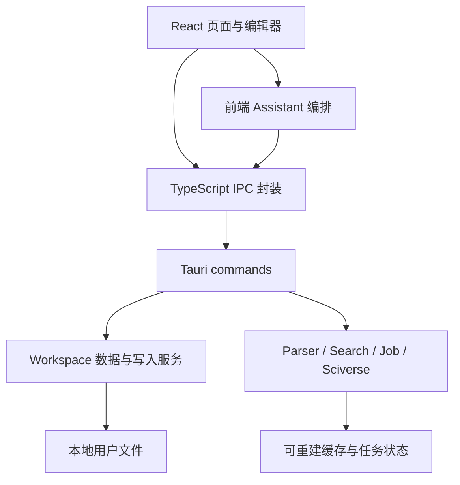

# NeuInk 系统审查与组件体系改造建议

审查日期：2026-09-13。以下保留审查时的代码快照，包含当时尚未提交的修改。
本文记录代码审查和拟议设计，实施状态统一维护在 [开发计划](../../docs/development/dev-plan.md)。首个悬停组件切片已实施：公共时序与关闭规则、浮层层级及缩放定位、PDF/Reflow 预览和独立检查页；其余建议按开发计划推进。

## 1. 结论

NeuInk 已具备本地资料、单篇阅读、多篇阅读、可追溯笔记、搜索、AI 审阅写入及成果导出的核心能力。当前不完善主要来自三个方面：

1. **对象能力没有完全贯通。** 标签和标签笔记已经独立，但搜索、Assistant 目标和部分回收入口仍围绕 Entry 组织。
2. **页面承担太多协调职责。** 添加一种对象或入口，需要同时修改应用根组件、阅读区、资料库和笔记绑定，功能之间的边界容易被穿透。
3. **基础控件已有复用，交互模式缺乏统一。** 同样是列表、预览、模式切换或拖动，不同页面仍自己决定行为和状态。

建议以现有 `components/ui` 为基础，建设 NeuInk 内部组件体系。重点是统一交互、对象展示和应用边界；基础按钮、弹窗和编辑器继续沿用现有实现。

## 2. 范围与证据强度

完成了前端文件和导入关系扫描，阅读了主应用、阅读区、条目库、标签、笔记、来源、搜索、设置、Assistant 接口及代表性 Rust 服务调用路径，并做了两项隔离行为验证。

| 指标 | 当前代码 |
| --- | --- |
| 前端非测试 TS/TSX 文件 | 334 个，约 76,982 行，含空行、导入和类型 |
| 前端测试文件 | 159 个 |
| 至少 400 行的非测试文件 | 57 个；行数用于定位热点，不单独构成缺陷 |
| `components/ui` 非测试文件 | 29 个，包含浮层基础设施 |
| Button / Dialog 的直接生产导入文件 | 98 / 30 个 |
| 业务原生按钮 | 96 处，分布于 50 个文件 |
| 业务原生 input / textarea | 17 / 5 处，分别位于 8 / 5 个文件 |
| 保守匹配到的较长重复函数主体 | 6 组，忽略注释和字符串引号差异，保留变量及业务逻辑 |

原生元素数量不等于违规数量：编辑器节点、PDF 选区、拖动柄、系统标题栏需要专门契约。导入关系也区分类型依赖和运行时依赖，不把类型引用称为运行时循环。

两项临时行为探针确认了现有模式切换的键盘缺口，以及笔记分栏在 `pointercancel` 时提交宽度的行为。探针用于记录现状，运行后已移除。此前 654 项前端回归通过不能替代这些尚未覆盖的交互；本轮未进行原生 Tauri 全流程视觉验收或大资料库性能基准。

## 3. 产品主线应围绕对象和任务

建议保持以下闭环：

**收集资料 → 用标签组织主题 → 阅读原文 → 记录和引用证据 → 跨论文归纳 → 检索与 AI 辅助 → 导出成果 → 删除、恢复和继续工作。**

### 3.1 统一概念

| 概念 | 应有含义 | 界面位置和关系 |
| --- | --- | --- |
| Workspace / 资料库 | 本地用户数据与权限边界 | 切换资料库必须隔离数据、任务、草稿和缓存 |
| Entry / 条目 | 一份可管理的资料，可暂时没有 PDF | 条目库管理；打开后进入其阅读内容 |
| Tag / 标签 | 有名称、描述、层级的主题集合 | 在条目库进入标签范围；标签成员关系不等于文件夹移动 |
| 文档笔记 | 独立可编辑文档，归属于一个 Entry 或 Tag | 条目笔记、标签笔记是同一种文档的不同归属 |
| 片段记录 | 附着在原文片段上的短记录 | 阅读原文时就地编辑，也可聚合查看 |
| 批注 | 高亮、选区或带类型与重要性的结构化记录 | 保留其定位和编辑语义，不强行变成文档笔记 |
| 来源链接 | 从笔记指向具体原文，并保留引用时快照 | 引用多个 PDF 不会自动改变笔记归属或论文标签 |
| 平行阅读 | 在一个标签范围中阅读、对照和记笔记的工作方式 | 复用 Tag、Entry、Note；不增加另一套资料集合 |
| Surface / 页面 | 对对象的一种打开方式 | PDF、重排、笔记、概览是页面，不是新的数据对象 |
| Job / 后台任务 | 解析、翻译、索引等可观察的执行过程 | 同一状态投影到页内和任务面板 |

`NoteOwner` / `NoteTarget` 已经给文档笔记建立了正确方向，继续扩展它们。`tag_reading` 的名称和存储目录是兼容债，现阶段不用搬动用户文件来换取命名整齐。

### 3.2 各阶段的完整性

| 用户阶段 | 已有基础 | 建议补齐 |
| --- | --- | --- |
| 打开、切换资料库 | 严格识别、创建、迁移、编辑保护 | 所有异步结果采用同一资料库隔离规则；失败可恢复 |
| 导入 PDF / 解析 ZIP | 进入归一化 Segment 流程 | 统一导入、解析、失败和重试状态；减少入口文案分叉 |
| 标签组织 | 描述、层级、条目库两种展示、回收 | 标签管理页仍要求鼠标双击，需与侧栏单击进入统一 |
| 单篇与多篇阅读 | PDF/Reflow、平行阅读、记录、翻译 | 统一工具栏动作和来源导航；保留不同阅读器渲染能力 |
| 笔记和证据 | 文档笔记共用编辑器、多来源、实时失效状态 | 统一归属展示、来源类型文案、来源行和编辑状态 |
| 找回已有知识 | 关键词/语义/混合搜索、笔记目录 | 搜索支持独立 Tag、描述及 Tag Note，不只搜索条目上的标签文字 |
| AI 辅助 | 上下文、证据、Proposal、后端审阅写入 | Tag Note 接入真实读取/写入目标前保持明确边界；不伪造 Entry |
| 导出 | 原文/译稿与阅读成果两条导出链路 | 统一范围和检查清单交互，保留两种导出数据语义 |
| 删除和恢复 | 条目、标签回收及来源失效提示 | 标签笔记目前在标签内“已删除笔记”中恢复，应有统一可发现入口 |

近期应优先完成这条主线，不增加更多与现有资料、笔记脱节的新页面。

## 4. 当前架构与主要边界问题



这个整体分层值得保留：普通文件是数据权威，Rust 承担关键写入，Parser 输出共用于阅读、来源与导出。问题集中在每层内部职责过宽和跨层协调散落。

### 4.1 根组件和阅读区成了通用协调中心

| 文件 | 规模与职责 | 建议边界 |
| --- | --- | --- |
| [App.tsx](C:/Users/sugrs/Desktop/neuink/apps/desktop/src/app/App.tsx:395) | 2,253 行、27 处 useState；同时管理页面、资料库范围、助手上下文、拖动、偏好、任务及写入动作 | 拆成应用外壳、导航控制、资料库控制、助手桥接和偏好控制；App 负责组合 |
| [ReaderPane.tsx](C:/Users/sugrs/Desktop/neuink/apps/desktop/src/modules/reader/components/ReaderPane.tsx:68) | 1,123 行、85 个顶层 props；还渲染设置、创建条目、标签管理等非阅读页面 | 将 Surface 容器放回应用层；阅读模块只负责 Entry 阅读 |
| [EntryLibraryView.tsx](C:/Users/sugrs/Desktop/neuink/apps/desktop/src/modules/reader/components/EntryLibraryView.tsx:71) | 1,647 行、34 个 props；查询、表格、标签浏览、统计、拖动和回收操作混在一起 | 移入 library 模块，拆查询模型、工具栏、论文表格、标签浏览、行操作 |
| [EntryWorkspaceView.tsx](C:/Users/sugrs/Desktop/neuink/apps/desktop/src/modules/reader/components/EntryWorkspaceView.tsx:67) | 1,125 行、65 个 props | 以阅读会话和动作接口组织，避免继续逐个透传回调 |
| [SettingsPanel.tsx](C:/Users/sugrs/Desktop/neuink/apps/desktop/src/modules/settings/components/SettingsPanel.tsx:1) | 1,488 行、33 处 useState | 按设置域持有加载/保存状态，布局只组合各设置区 |

拆文件的完成标准是减少跨模块知识和状态来源。把全部参数塞进一个 `props` 对象，或换成一个全局 Context，并不能完成这项改造。

### 4.2 领域展示类型放在了侧栏组件中

`LibraryEntry` 定义在 [LibrarySidebar.tsx](C:/Users/sugrs/Desktop/neuink/apps/desktop/src/modules/library/components/LibrarySidebar.tsx:37)，共有 30 个生产文件直接导入该模块，其中 28 个是纯类型导入。`toLibraryEntry` 又位于应用层的 [appSupport.tsx](C:/Users/sugrs/Desktop/neuink/apps/desktop/src/app/appSupport.tsx:211)。

建议把资料展示模型和转换放到 library 的 model 层；真正跨域的领域类型继续位于 `shared/types`。侧栏、阅读器和助手消费同一模型，类型不再由某个可视组件输出。`ReaderPane` 移回应用层后，也能减少 reader 对 App 导航和设置模块的反向依赖。

### 4.3 Rust crate 方向合理，部分 IPC 文件已承担服务职责

例如 [search.rs](C:/Users/sugrs/Desktop/neuink/crates/neuink-ipc/src/commands/search.rs:133) 内持有多种缓存、清理循环、索引构建及检索编排；[translation.rs](C:/Users/sugrs/Desktop/neuink/crates/neuink-ipc/src/commands/translation.rs:423) 包含翻译任务执行；[entry.rs](C:/Users/sugrs/Desktop/neuink/crates/neuink-ipc/src/commands/entry.rs:542) 同时处理元数据、笔记资源和 PDF 导入。

逐步抽出内部服务模块，command 保留请求校验和调用适配。服务稳定后再判断是否需要新 crate。现有 Note 版本检查、标签事务恢复、Source 快照和导出预检应保留，不能在 UI 重构中一起替换持久化格式。

## 5. 已确认的问题与风险

优先级定义：**先处理**表示会直接影响日常操作或改造安全；**随后处理**表示结构和规模风险。风险项与已复现行为分开描述。

| 编号 | 发现 | 证据、影响和处理建议 |
| --- | --- | --- |
| R1 · 先处理 | 拖动取消语义不统一，已验证 | [useResizableNotePane](C:/Users/sugrs/Desktop/neuink/apps/desktop/src/modules/reader/components/pdf-reader/useResizableNotePane.ts:32) 把 pointercancel 接到提交函数；390px 拖到 290px 后取消，仍写入 290px。App 侧栏有相同写法。平行阅读的 [useReadingSplit](C:/Users/sugrs/Desktop/neuink/apps/desktop/src/modules/reader/parallel-reading/ReadingSplitDivider.tsx:55) 已区分提交与回滚。抽取共用 resize 手势，分别保留各区域约束和存储位置。 |
| R2 · 先处理 | 模式切换存在不完整的标签页语义，已验证 | [ReaderModeSwitch](C:/Users/sugrs/Desktop/neuink/apps/desktop/src/modules/reader/components/ReaderSurfacePrimitives.tsx:33) 使用 tablist/tab，但没有方向键切换和单焦点管理；两个按钮同时 tabIndex=0。应根据实际语义接入既有 Tabs 或单选 ToggleGroup。 |
| R3 · 先处理 | 浮层缺乏统一坐标与层级规则，代码确认、全场景待验收 | Popover/Select 已使用语义层级和可选 ViewportOverlay；[HoverCard](C:/Users/sugrs/Desktop/neuink/apps/desktop/src/components/ui/hover-card.tsx:19)、[Tooltip](C:/Users/sugrs/Desktop/neuink/apps/desktop/src/components/ui/tooltip.tsx:29)、ContextMenu 仍主要用 z-50。阅读预览又有专用 Portal。应统一宿主、缩放、层级及关闭条件，保留坐标型阅读预览的专门锚点。 |
| R4 · 先处理 | 同一个 Tag 的打开行为仍有分叉 | 侧栏/条目库单击进入，但 [TagEditorNode](C:/Users/sugrs/Desktop/neuink/apps/desktop/src/modules/library/components/TagEditorNode.tsx:98) 鼠标双击才打开，键盘 click 单独分支。重命名已有显式按钮，统一标签名称的打开契约即可。 |
| R5 · 先处理 | 全局搜索未覆盖独立标签和标签笔记 | [WorkspaceSearchRecord](C:/Users/sugrs/Desktop/neuink/crates/neuink-workspace/src/search.rs:27) 强制 entry_id，记录从 Entry 循环收集；[openSearchResult](C:/Users/sugrs/Desktop/neuink/apps/desktop/src/app/App.tsx:1234) 先要求 Entry 存在。空标签、标签描述及综合笔记无法形成完整搜索结果。需扩展搜索目标模型和索引，不在 UI 上拼假条目。 |
| R6 · 先处理 | 异步写回的资料库隔离不一致，风险待定向复现 | [useWorkspaceResourceActions](C:/Users/sugrs/Desktop/neuink/apps/desktop/src/shared/hooks/useWorkspaceResourceActions.ts:97) 的描述更新/标签恢复检查 currentRoot；许多其他动作没有同等检查。[refreshEntries](C:/Users/sugrs/Desktop/neuink/apps/desktop/src/shared/hooks/useWorkspace.ts:120) 和打开后续读取也直接写状态。快速切库时旧响应可能污染新资料库的 UI；这里没有据此断言发生了磁盘数据损坏。应建立统一的资料库会话标识和结果提交检查。 |
| R7 · 随后处理 | 编辑保护职责正确，接口位置和标识仍耦合 | 笔记租约、笔记 dirty、片段 dirty 分别解决不同问题；[editSafety](C:/Users/sugrs/Desktop/neuink/apps/desktop/src/app/editSafety.ts:1) 已协调它们。标签描述、笔记动作也注册到 reader 的 segment registry，名称和依赖已经超出片段。先将通用编辑范围契约下沉并提供适配，保留笔记单编辑者租约和版本语义，避免再建一套并行注册表。 |
| R8 · 随后处理 | 目录与来源状态重复读取，规模风险未测量 | [WorkspaceNotesProvider](C:/Users/sugrs/Desktop/neuink/apps/desktop/src/modules/notes/WorkspaceNotesContext.tsx:21) 合并事件后全量读取；后端 [read_note_catalog](C:/Users/sugrs/Desktop/neuink/crates/neuink-workspace/src/note_catalog.rs:45) 读所有笔记并检查来源，挂载的 NoteSourcesProvider 也会检查来源。后端单次检查已有按 Entry 缓存。应先记录读取次数/耗时，再做按对象失效与共享结果缓存。 |
| R9 · 随后处理 | 默认宽度的偏好解析存在确定性缺口 | [readStoredSidebarWidth](C:/Users/sugrs/Desktop/neuink/apps/desktop/src/app/appSupport.tsx:143) 和笔记分栏都直接 Number(localStorage.getItem(...))；缺值 null 变成 0，被钳到最小宽度，而非声明的默认值。统一偏好读取：缺值、非法值、旧格式、越界值分别处理。 |
| R10 · 随后处理 | 来源类型文案已出现实际分叉 | [SourceLinksPanel](C:/Users/sugrs/Desktop/neuink/apps/desktop/src/modules/notes/components/SourceLinksPanel.tsx:110) 使用 equation/text 等映射，未覆盖领域值 math/paragraph；[SourceLinksSurface](C:/Users/sugrs/Desktop/neuink/apps/desktop/src/modules/reader/components/SourceLinksSurface.tsx:95) 则有对应中文。将类型归一化和标签格式化集中到来源模型层。 |
| R11 · 随后处理 | 加载、错误和空状态缺少共同展示规则 | 有 Empty、ReaderEmptyState 和大量就地提示。[TagNotesList](C:/Users/sugrs/Desktop/neuink/apps/desktop/src/modules/notes/components/TagNotesList.tsx:55) 的空判断未排除加载失败，可能同时出现错误和“暂无笔记”。统一首次加载/刷新、错误/空内容的呈现契约，保留刷新失败时的可读数据。 |
| R12 · 随后处理 | 后台任务已有共同数据，操作入口还不完整 | JobStatusDock 展示任务和进度，翻译等页内另有操作；Sciverse 导入还由 App 汇总本地任务。任务面板应提供按任务能力定义的打开、取消/暂停、重试入口，保留各任务自身执行逻辑。 |

### 5.1 明确可以收敛的重复实现

| 重复实现 | 当前位置 | 合适的归属 |
| --- | --- | --- |
| ImportanceBadge | AnnotationLibraryView:501；SegmentAnnotationEditor:865 | annotations 的共享业务组件；重要性颜色改用语义 token |
| 搜索匹配文本高亮 | SearchResultList 的 SnippetText:226；SearchResultPreview 的 HighlightedContext:280 | search 的 HighlightedText；只负责纯文本分段与标记 |
| fieldsToRecord | EntryFieldsEditor:105；CreateEntryPanel:571 | library 的字段规范化函数 |
| cleanFields | useWorkspace:487；useWorkspaceResourceActions:922 | 共享输入规范化函数，覆盖保留字段规则 |
| intersectionArea | pdfPageAnnotations:134；PdfSourcePage:1078 | reader 的几何工具，使用相同坐标域 |
| scopedEnabledToolIds | assistant/sdk/tools:101；toolSupport:71 | Assistant 工具策略模块；这是权限范围逻辑，应保持唯一实现并保留行为测试 |

这些是较长函数主体的保守匹配，不是全仓库“重复率”。另外，设置中的 `SwitchRow` / `ReaderSettingRow`、标签显示、列表工具栏属于相同模式的不同实现，适合通过明确变体收敛。

### 5.2 不应机械合并的部分

- PDF 与 Reflow：共享动作、来源、笔记、翻译、工具栏规则；渲染、坐标、虚拟滚动和阅读偏好保留专用实现。
- SourceLinksPanel 与 SourceLinksSurface：前者显示笔记引用了什么，后者显示哪些笔记引用论文；共享来源行、状态和格式化，不合并查询语义。
- 文档笔记、片段记录、批注：统一状态和常用编辑外观，保留不同存储及保存契约。
- 论文内容导出与阅读成果导出：共享范围展示、问题清单和动作状态，继续使用各自的数据采集与预检。
- 数据表格、目录树、命令搜索列表：共享密度、焦点和行内动作约定，继续分别使用 table/tree/command 的结构。
- 旧 TagDetailsView 与 useSourceBacklinks 的兼容分支：明确迁移条件、调用者和退出标准后再删除，不把兼容保护误判为无用代码。

## 6. NeuInk 内部组件体系

### 6.1 建议的层次与依赖方向

以下为目标结构，不代表这些新模块已经创建：

```text
styles/theme.css                      颜色、层级、密度、焦点、动效 token
components/ui/                        现有 Radix/shadcn 基础控件
components/patterns/                  跨业务的页面、行、状态和表单组合
shared/interaction/                   浮层/resize/焦点等纯交互契约
shared/editing/                       通用编辑范围契约及现有注册表适配
modules/<domain>/model/                对象查询、展示模型、动作
modules/<domain>/components/           领域组件
app/                                  页面路由、布局、工作区切换与组合
```

依赖从 App 向领域模块和共享层流动。`ui` 与 `patterns` 不读取 Workspace、不调用 IPC、不依赖某个业务页面；领域组件通过明确的 model/actions 组合，不从侧栏或页面导入基础类型。按迁移切片创建目录，不预建空包。

### 6.2 首批组件及迁移对象

| 组件/能力 | 负责什么 | 首批消费者 |
| --- | --- | --- |
| PageFrame / PageHeader | 标题、路径、说明、操作区和正文边界；明确唯一滚动所有者 | 条目库、来源列表、批注聚合 |
| SearchField / FilterBar | 搜索、清除、筛选反馈、窄区域换行；查询由页面持有 | 条目库、标签笔记、回收站 |
| ListRowContent / RowActions | 标题、元信息、状态、动作槽；不擅自处理整行点击 | 标签笔记、来源列表、阅读队列 |
| NavigationRow | 图标、标题、数量、当前项和键盘焦点 | 侧栏快速视图、设置导航 |
| TreeRow | 层级、展开箭头与名称动作的事件边界 | 标签侧栏、标签管理 |
| ContentTabs / ModeSelect | 栏目切换与单选展示的语义分别实现，复用 Tabs/ToggleGroup | 片段面板、笔记面板、列表展示 |
| ResourceState / StatusLine | 首次加载、刷新中、空、错误、只读及下一步 | 笔记、来源、搜索、队列 |
| SettingRow / FormField | label、说明、控件、错误、禁用状态和关联 ID | 常规设置、阅读设置、Agent 设置 |
| StatusBadge / SaveStatus | 共同视觉、可访问状态和统一保存文案；不持有保存逻辑 | 解析、笔记、描述、导出 |
| OverlayHost 与现有浮层封装 | Portal 坐标、层级继承、缩放、边界、关闭和焦点恢复 | HoverCard、Tooltip、Popover、菜单、阅读预览 |
| usePointerResize | 阈值、pointerId、取消回滚、清理、键盘等价操作 | 侧栏、笔记分栏、平行阅读 |

领域组件放回领域：TagPath/TagChipGroup、SourceReferenceRow、SourceAvailabilityMessage、AnnotationImportanceBadge、EntryActionsMenu、ReadingModeControl 等。它们可共用模式组件，但不把 Tag、Note 或 Source 的判断塞进基础 Button。

同一个组件至少有两个清晰消费者后再推广。扩展用有限变体与组合槽位，避免一个 List 组件通过几十个布尔参数控制所有页面。

### 6.3 Hover 和列表的统一契约

| 行为 | 契约 |
| --- | --- |
| Tooltip | 解释短标签/图标；无输入和关键操作；键盘聚焦也可访问 |
| Hover preview | 补充摘要；延迟由少量语义预设管理；导航、拖动和锚点消失时关闭 |
| 点击预览 | 需要滚动、复制或操作的内容用 Popover/有界 Dialog；不能只在悬停时访问全文 |
| 阅读坐标预览 | 使用同一浮层宿主，保留 PDF/Reflow 专门的坐标适配 |
| 列表单击 | 在同一对象和入口类型中保持一致；打开、选择、展开分别有明确元素 |
| 行内操作 | 不触发行导航；右键和键盘动作与可见按钮共用动作实现 |
| 焦点 | 焦点、选中和 hover 各有状态；列表/树/命令菜单按自身语义管理方向键 |
| 截断 | 名称截断仍可访问完整路径；正文摘要有明确展开入口 |
| 滚动 | 页面正文或表格容器拥有滚动；行组件不创建独立滚动容器 |
| 拖动 | 区分 resize、排序、标签归属、编辑器块移动；共用低层手势，不合并业务提交 |

不得通过增大 z-index 修复所有浮层问题。窗口缩放、CSS zoom、锚点尺寸、Portal 所在容器和弹窗层级必须一起验证。颜色统一也要区分界面状态与用户内容：PDF 白纸、图表配色和用户高亮不是普通 UI token 替换对象。

### 6.4 状态所有者

| 状态 | 唯一所有者 | 组件消费方式 |
| --- | --- | --- |
| 工作区根路径、数据及会话标识 | Workspace 数据层 | 按工作区读取；旧会话结果不能提交 |
| 打开的页面、左右分栏和焦点 | 应用导航/布局层 | 页面发出打开/定位意图，不自行复制路由 |
| 标签范围、查询、排序和视图 | Library controller | 两种论文展示消费同一个结果模型 |
| 文档内容、版本、保存和编辑权 | 现有文档会话与笔记租约 | 标题栏和工具栏显示状态、调用动作 |
| 导航前是否可以保存/离开 | 通用编辑范围协调层 | 页面注册受影响对象；失败不推进导航 |
| 来源目录、反向引用和可用性 | 可重建的查询/来源层 | UI 只显示结果，不重复判断文件是否存在 |
| 浮层打开、锚点和返回焦点 | 对应交互组件 | 不改变资料归属或页面查询 |
| 任务执行与进度 | 对应执行服务；前端统一投影 | 页内和任务面板显示同一执行状态 |

## 7. 组件展示与验证设施

建立一个仅开发模式开放的组件展示页，使用真实组件与固定示例数据，不连接用户资料库。现有 React、Vite、Vitest、Testing Library、Radix 和 Tailwind 足够支撑首版，无需立即增加 UI 框架或独立发布包。

展示页按“导航、列表、浮层、表单、状态、编辑、拖动”组织，每个交互族同时展示：正常、加载、刷新失败、空、只读、禁用、长中文/英文、长列表与窄面板。提供主题和 100%/125% 缩放切换，以及简短的动作记录以检查事件冒泡。

验证分三层：

1. 组件行为：方向键、焦点恢复、行内动作、Escape、pointercancel、保存期间继续输入、失败重试。
2. 页面场景：标签→条目→笔记→来源→返回；PDF/Reflow/平行阅读使用同一目标；切库不串数据。
3. 原生 Tauri：真实缩放、分屏、Portal、选区、系统菜单、窗口关闭、拖动和长文档；浏览器验证不能替代这一层。

组件目录最终只是入口，真正资产是可复用实现、场景样例和行为测试。按需要增加依赖边界检查与最小 CI；当前没有扫描到 .github 工作流或组件展示设施，不能把它们写成已具备能力。

## 8. 实施顺序与验收

| 切片 | 具体交付 | 完成条件 |
| --- | --- | --- |
| A · 交互基线 | 修复 R1/R2/R4/R9，建立浮层层级和 resize 契约；建最小组件展示页 | 现有 UI 原语继续复用；拖动取消、键盘、100%/125% 和窄面板通过 |
| B · 一个真实交互族 | 优先统一条目库、标签笔记、来源列表的行内容/工具栏/状态；迁移字段与搜索高亮等重复逻辑 | 新组件有至少两个实际消费者；页面查询和滚动行为保持清楚；旧重复实现移除 |
| C · 应用边界 | LibraryEntry/转换下沉；条目库回归 library；Surface 容器移回 app；抽出导航和工作区控制 | Reader 模块不再负责设置/标签管理页面；新增一个页面无需扩充阅读器的大量回调 |
| D · 工作区与编辑安全 | 统一异步结果提交隔离；编辑范围接口适配现有注册表；约定旧详情/旧笔记查询分支退出条件 | 切库、保存失败、并发输入、删除恢复、分屏关闭及旧状态迁移都有回归 |
| E · 对象能力贯通 | 独立 Tag/Tag Note 搜索目标；统一笔记发现与恢复入口；再接 Assistant 真实目标 | 从全局搜索可打开空标签/描述/综合笔记；无 PDF 可记笔记，删除原文不丢快照 |
| F · 规模与发行 | 测量目录/来源重复扫描，按对象失效；收敛任务操作；建立干净环境与原生验证基线 | 有可重复的样本、耗时、读取次数和结果；编译成功与原生验收分别记录 |

A 与 D 中的资料库隔离风险优先于大规模搬迁；每个切片独立可回退，不同时更改导航、存储格式和编辑器。实施过程中持续更新开发计划中的完成状态，不在多个文档维护平行任务清单。

首批建设的价值应体现在：一处修正让多个页面同时变好，用户在各处都能预测点击、预览、保存、取消和返回的结果。
