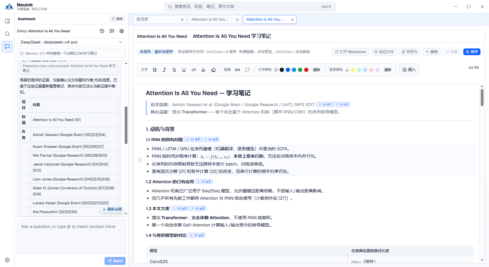

助手可以解释材料、检索证据、整理文档笔记和提出元数据修改。可靠使用的关键是：先选对上下文，再核对来源，最后确认实际写入。

## 对照界面看操作

左侧选择关联条目与模型、输入问题并查看回答；右侧显示笔记成果。图中未保存提示仍需处理。

*仓库已有实机截图，已裁去含服务地址的底栏；按钮可能随版本变化。点击图片查看原尺寸，或阅读[完整界面图解](screenshots.md)。*

## 配置对话模型

在“模型与助手”新建连接，选择接口协议、地址和模型 ID，按服务要求填入密钥。测试连接后指定“助手对话模型”。阅读翻译使用独立任务模型，详见[模型设置](settings.md)。

Neuink 不捆绑大语言模型。连接本地模型或远程模型由你选择，发送的上下文会交给该服务处理。

## 阅读对象与 @ 附件

助手可关联当前论文、PDF、文档笔记或受支持的阅读对象。用 `@` 明确附加条目、标签、文档笔记与片段；不需要任何材料时选择“不关联内容”。

分屏中应确认当前聚焦对象。显式选择的材料、当前对象和历史引用会影响范围；不要只凭侧栏中显示的论文标题推断本轮已经读了哪些内容。标签综合笔记当前不作为普通附件或通用修改目标。

## 可以怎样提问

- **解释**：“根据当前片段解释这个方法，区分原文结论和你的补充说明。”
- **比较**：“只比较这两篇论文中的评价指标和实验条件，不同口径请分开列出。”
- **整理**：“将已核对的研究问题、方法、结果和局限整理为文档笔记提案，保留来源。”
- **发现**：“检索与当前主题相关的公开论文，给出真实链接，暂时不要导入。”

这些是提问示例，不是内置按钮或保证输出的固定模板。证据不足时应保留未确定项。

## 未解析 PDF 也能问吗

有可用文字层时，助手可以按页做基础读取与字面搜索。每次页读取至多 5 页，文字搜索每次至多扫描 20 页；基础上下文在需要时读取前 3 页以内，并说明覆盖与截断。

这条路径不执行 OCR、不自动提交解析，也不把条目标为已解析。扫描页、双栏顺序、复杂图表与公式可能不可靠；需要结构化证据时应使用 MinerU 结果。

## 来源、工具与完整回复

回答中的来源应能对应实际取得的证据。工具记录用于了解发生过哪些读取或检索，不能把工具失败当作“没有相关文献”。外部 URL 证据与本地页码来源会分别保留。

长回复可打开完整回复标签，与论文并排阅读。表格、公式和 Mermaid 在支持的回复中渲染；图表内容仍需核对。对话历史与执行记录保存在资料库中，可回看提案和工具状态。

## 从提案到实际保存

1. 助手提出新建或修改文档笔记、片段笔记、标签或元数据的建议。
2. 打开修改预览，查看新增、删除以及修改前后的完整内容块。
3. 核对来源、目标和改动范围，选择应用或拒绝。
4. 应用时后端检查版本与内容；目标已变化会阻止覆盖。

收到一份提案不等于文件已经修改。已应用修改也不因后来停止对话而自动回滚。

## 排队、停止与失败

运行中的消息与待发消息在任务区分别显示，待确认、待选择和暂停也有独立状态。停止会取消当前执行，但不会撤销此前已完成的入库或已确认修改。

普通只读工具失败可交回助手继续处理；模型、预算或持久化错误可能导致任务中止。需要排查时，在“工具与扩展 → 诊断”开启助手调试信息，查看安全分类与状态码；不要将密钥或完整私密正文贴入公开问题。

## 高级能力的可见范围

代码中存在主／子助手与工具权限机制，但当前普通设置隐藏了高级助手、子助手和 MCP 配置入口。不要按架构文档中出现的名称假设界面已经提供可配置插件市场或任意脚本执行能力。
