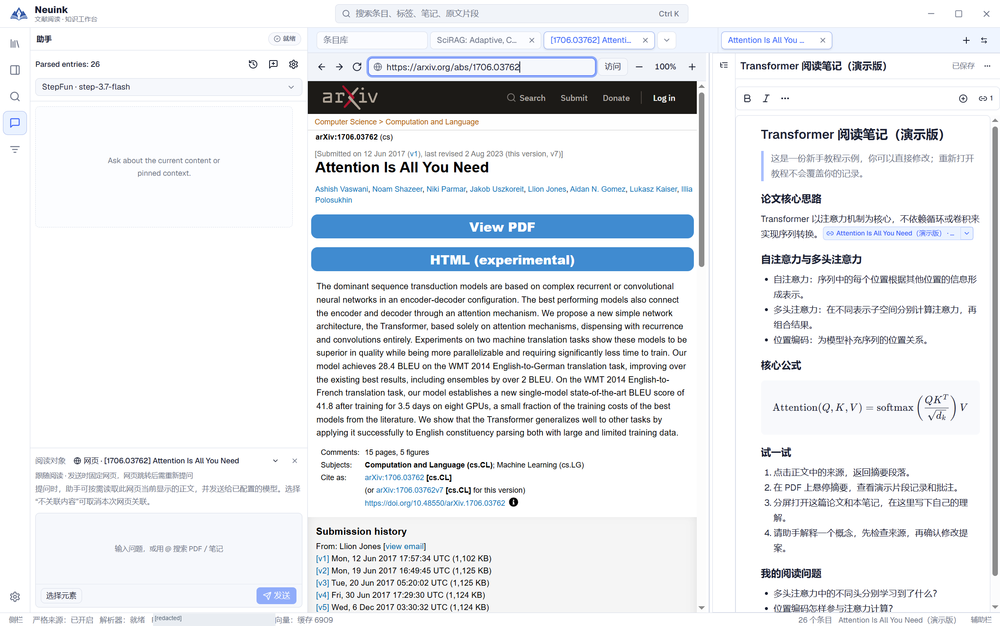

Windows 原生应用可在工作区内打开网页，与 PDF 和笔记共享标签及分屏。它适合阅读论文主页、公开资料和参考链接，而不必每次离开研究上下文。

## 按步骤看实际界面

按下面的步骤找到入口，并检查操作结果；点击图片可放大查看。

### 1. 打开论文主页并确认关联对象

点击标签栏“＋”，输入公开论文网址并访问。图中 arXiv 页面已加载，助手的阅读对象变为当前网页；可一边查看网页一边整理笔记。

## 打开与管理网页

使用标签栏“＋”建立网页标签，或从助手回复中的 HTTP(S) 链接进入。地址栏支持前进、后退、刷新、停止和独立缩放；当前最多同时打开 8 个网页。

网页可以在左右分屏间移动。页面内部的新窗口链接在支持范围内转成同侧新标签，某些先开空白窗口再填充内容的网站流程不适用。缩放网页不会同时缩放整个 Neuink 界面。

## 让助手读取当前网页

1. 等待网页加载到需要的内容。
2. 在助手中关联当前网页，或明确选择不关联。
3. 请求读取正文；如果只需要一段，先选择文字并请求读取选区。
4. 查看回答中的实际覆盖范围与来源链接。
5. 需要保存时，选择文档笔记目标并审阅提案。

打开、聚焦网页本身不会自动上传正文。真正读取时，内容作为不可信资料交给你配置的模型，不作为可以覆盖用户意图的指令。

## 为什么切页后有时需要重新关联

助手使用的是发送问题时选定的网页。原标签重载、跳转或关闭后，旧请求不会去读取另一个恰好获得焦点的页面；重新关联当前页面再发起即可。

旁边的 PDF、旧对话中的论文和隐藏选区不会因为网页任务而自动成为本轮目标。选区模式只读当前 DOM 选区，不启动视频媒体提取。

## 三类内容的读取范围

| 内容 | 支持与限制 |
| --- | --- |
| 普通网页 | 在已加载页面中提取正文，排除表单、密码、编辑区和隐藏内容；非文章页可回退为有界可见文字。 |
| 公开 PDF | 重新获取公开资源后用 PDF.js 提取文字；上限 12 MiB，默认前 8 页，每次可指定 1–20 页，显示总页数与截断。 |
| YouTube／哔哩哔哩具体视频 | 提取公开简介和一条可用中／英文字幕，保留时间戳，不下载音视频。 |

公开 PDF 不自动导入资料库、执行 OCR 或调用 MinerU。视频无字幕、直播、站点限制等情况会明确说明；简介和字幕不代表已经观看画面或理解音频。

## 网络与平台边界

公开 PDF／视频可能发起新的网络请求，但不携带浏览器登录 cookies，也不绕过访问控制。登录后才能看到的视频或受限 PDF，不能因为网页可见就保证专用提取能成功。

原生嵌入目前在 Windows 启用；视频运行时当前随 Windows x64 构建提供，需要相应资源。其他平台的能力以实际版本为准。

## 出错时

超时可发生在下载或文字提取阶段，减少页数只可能帮助提取阶段。网络停滞、源站限制与缺字幕应分别处理。取消、导航或关闭页面会清理当前读取，不能用之前的部分结果冒充完整成功。

如果网页遮住了菜单或浮层，可先切换到 PDF 或笔记标签再操作；反馈问题时说明系统、应用版本和重现步骤。
