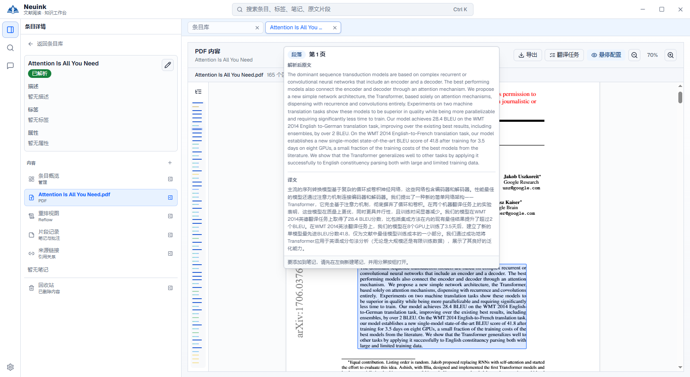

先决定要分享“原论文的整理稿”还是“自己的阅读成果”，再选择格式和范围。导出是独立文件交付，不等于复制整个资料库。

## 对照界面看操作

PDF 区域右上角的“导出”按钮就是全文与译稿导出的入口。此图展示按钮位置，尚未展示打开后的格式选择对话框。

*仓库已有实机截图，已裁去含服务地址的底栏；按钮可能随版本变化。点击图片查看原尺寸，或阅读[完整界面图解](screenshots.md)。*

## 格式与入口

| 对象 | 入口 | 格式 |
| --- | --- | --- |
| 解析全文、中文译稿、双语稿 | PDF／重排的导出操作 | DOCX、TXT、带图片的 Markdown ZIP。 |
| 文档笔记、片段笔记、批注、译文片段 | 条目概览、文档笔记菜单或就地导出按钮 | 合并 DOCX／TXT，或逐项 DOCX／TXT ZIP。 |
| 文档笔记源码 | 笔记文件操作 | 本地 Markdown，含可读来源脚注。 |
| 标签综合笔记 | 标签笔记编辑页的导出入口 | Word／TXT，保留可读来源信息。 |

不同入口支持的范围不同。标签综合笔记不是假造的论文条目，不应假设它自动出现在旧的论文批量导出清单中。

## 导出全文与译稿

选择原文、中文或双语，然后检查覆盖清单。导出读取全部规范化内容与已保存译文，不根据当前折叠、隐藏流程图或滚动可见范围裁切。

未译、旧译文和缺图会列出；需要草稿时明确确认“含待核对内容”后继续。图片内文字尚未核验会记录提示，不等于图片已经翻译。

## 选择阅读成果

在清单中筛选类型并选择具体项目，确认标题、预览和数量。批量结果可合并成文件，或每项独立文件打包，并附索引。

片段旁的导出按钮只针对点击时的范围；空选择不是“导出全部”。未保存的笔记或批注需要先处理，再刷新检查结果，避免分享旧正文。

## 图表、图片与公式

全文导出可按支持项选择 Mermaid 原图、渲染图、源码或原图附源码，设置 Word 图片宽度。渲染失败会报告，不自动修改科学图的含义。

DOCX 尽量保留标题、段落、表格和图片的内容结构，不承诺复刻原 PDF 双栏版式。公式保留可用源表示，复杂内容可能回退；阅读成果导出中的公式与 Mermaid 有源码保留边界，请核对实际文件。

## 来源与可携带性

导出中的题名、页码、DOI／网址和文字快照让接收人不用安装 Neuink 也能理解出处。Markdown 图片包使用相对资源；Word 嵌入可用本地图片。

分享包排除密钥、会话和未选择的笔记，不是整个 Workspace 的压缩备份。生成前重新核对内容指纹，源文件改变时需要重新检查。

## 尚不支持的输出

当前不提供直接生成中文 PDF、带批注 PDF、自动排版 PPTX，也未接通从应用拖到桌面直接生成文件。要分享文档，请使用当前已支持的导出入口；不要把 Word 输出称作“PDF 导出完成”。

## 导出后的核对清单

1. 在接收人使用的软件中打开，核对中文、图片、表格和公式。
2. 检查是完整稿还是草稿，未完成部分有没有说明。
3. 确认只包含选定内容，来源能被独立理解。
4. 把文件移出资料库后再打开，检查资源是否仍可读。
