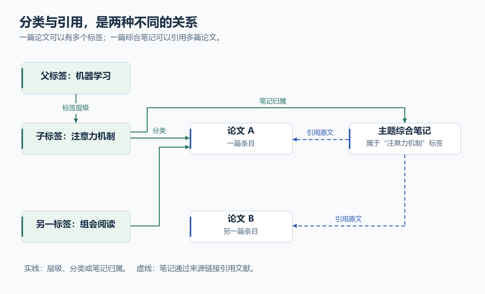

关系图帮助你看清资料库已经建立的结构：一个主题包含哪些论文，一篇笔记属于哪里，又引用了哪些原文。

## 先读懂连线代表什么

这是一张关系示意图。进入实际关系图后，先选择要看的关系类型：找主题成员看分类，检查结论依据看来源引用。详细区别见[核心概念](concepts.md)。

## 按步骤看实际界面

按下面的步骤找到入口，并检查操作结果；点击图片可放大查看。

### 1. 打开关系图总览

从资料库进入关系图，查看标签、论文和笔记之间已有的连接。节点与数量来自当前资料库，图形布局可能随数据变化。

### 2. 筛选要观察的关系

展开关系类型菜单，分别控制层级、归属、笔记与来源关系。先缩小范围，再查看具体节点，避免把所有连线都理解为引用。

## 从哪里打开

在条目库页眉点击“关系图”。它打开独立工作区标签，再次进入可复用已有页面；不会替换左侧工具的用途。

## 四种关系

| 关系 | 表达的事实 |
| --- | --- |
| 标签层级 | 父标签与子标签。 |
| 论文归属 | 论文被显式赋予的标签。 |
| 笔记归属 | 文档笔记属于论文，综合笔记属于标签。 |
| 来源引用 | 笔记记录了某篇论文的来源证据。 |

父标签累计包含论文，不会自动画成额外的显式归属。图上没有数据支持的连线不会被补成引用、因果或相似关系。

## 搜索、筛选和聚焦

输入标签、论文或笔记名称，查看匹配对象及其直接关系。通过“关系类型”筛选保留你关心的边；“全部关系”清除相关限制。

选中对象后可聚焦它及其直接关联，从复杂网络切到一个局部问题，例如“这篇综合笔记引用了哪些论文”。

## 三维与二维查看

三维视图可缩放、旋转或平移，悬停看简要内容，点击看详情。后侧节点会减弱显示以控制拥挤；视觉上的弱化不是数据被删除。

选中对象可按界面操作展开二维直接关系，二维状态锁定旋转。关闭详情与退出二维是不同操作，退出可恢复之前镜头。WebGL 不可用时仍保留对象列表与详情访问。

## 详情与查看历史

详情显示完整对象信息和可用来源快照，可继续选择关联对象、打开论文或笔记，再返回关系图。前进／后退用于查看对象历史；返回时保留查询与视图上下文。

原论文已删除或来源失效时，图中可以保留不可用对象与快照提示，不把缺失内容直接隐藏成“从未引用”。

## 关系图不代表什么

这不是自动生成的学术引用网络、研究热点地图或因果图。它不根据标题相似度推断“论文 A 影响了论文 B”，也不证明某个方向具有创新性。在线文献发现是[研究检索](research.md)的职责。
