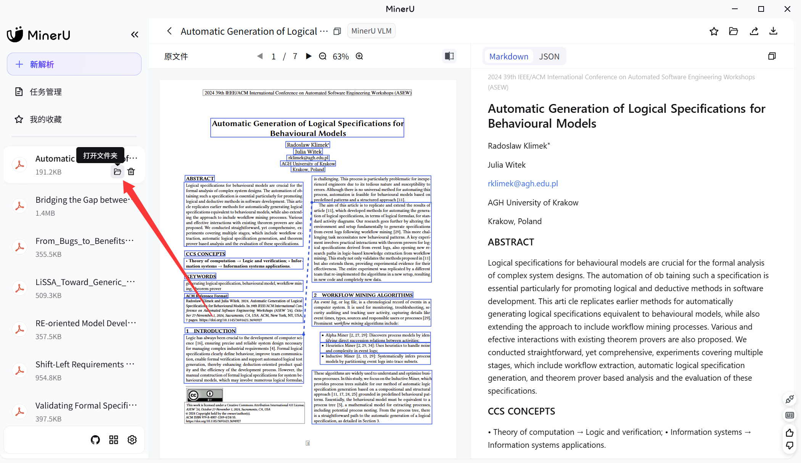
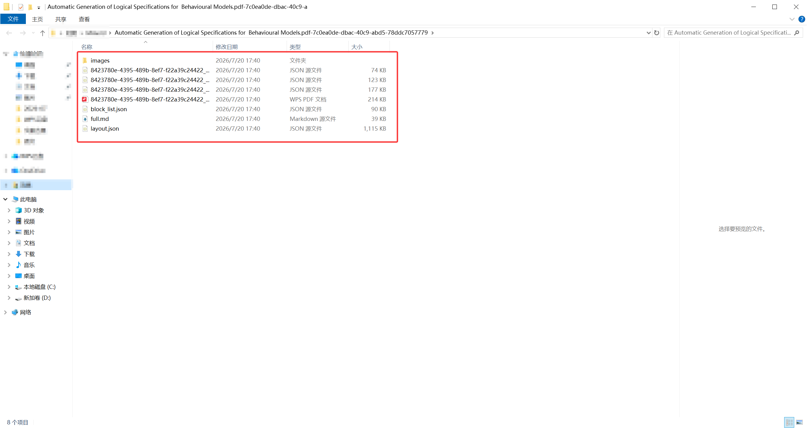

导入负责把文件放进资料库，解析负责识别段落、标题、表格、公式和图片。**能够打开 PDF，不等于已经有结构化解析结果。**

## 路径一：先导入 PDF

在条目库创建条目并附加 PDF，或批量拖入 PDF。导入后可以立即使用原文阅读器；解析可之后再做。需要重新附加或创建新版 PDF 时，从条目概览的文件操作进入。

默认不会在导入后自动提交解析服务。需要自动解析时，先设置自己的 MinerU 服务，再主动开启“导入 PDF 后自动解析”。

## 路径二：导入 MinerU 客户端 ZIP

设置“导入与解析”首先展示“MinerU 客户端（推荐）”。在应用内打开图文教程，按客户端完成解析、导出完整结果并压缩为 ZIP，再返回 Neuink 导入。

### 第一步：完成解析，打开结果文件夹

在 MinerU 客户端完成 PDF 解析后，找到对应任务，点击任务旁边的文件夹按钮。下图红箭头指向“打开文件夹”；右边能看到解析后的文字。

**检查结果**：应打开这篇论文的解析结果目录，而不是仅下载一份 Markdown。图中是 MinerU 客户端，不是 Neuink；客户端版本变化时按钮位置可能不同。

### 第二步：检查文件，再压缩完整结果

保留结构化 JSON、图片目录及原有相对路径。下图红框展示一份结果目录：有 images 文件夹、多个 JSON、PDF 与 Markdown。截图中的本地路径已做遮挡。

**检查结果**：需要有 Neuink 支持的 content_list_v2.json 或兼容 content_list.json；部分长文件名在图中被截断，请实际检查完整文件名。不能仅凭图里的 block_list.json 或 full.md 判断结果可导入。将完整结果压缩成 ZIP，并保留图片相对目录。

### 第三步：回到 Neuink，选择导入目标

- **用 ZIP 创建新条目**：同时附上原 PDF。
- **向已有 PDF 条目导入结果**：无需在 ZIP 中重复附 PDF。

ZIP 导入不要求填写解析服务 URL 或 API Key。只打包一份 Markdown 文本不等同于完整 MinerU 结果；缺少结构文件或图片时，需回到结果目录检查。这一步的 Neuink 导入对话框尚未补充实机截图。

### 第四步：打开 PDF 和重排，核对结果

确认 PDF 的片段框、重排正文、表格与图片对应同一篇论文。正文能显示但图片缺失，仍不能视为完整导入；具体检查清单见下方“如何检查解析质量”。

## 路径三：连接自己的服务

在“自建 MinerU 服务”中填写服务 URL，可按服务要求填写 API Key；应用通过 `X-API-Key` 请求头发送该密钥。服务可以返回兼容 JSON 或解析 ZIP。

这里配置的是你自己的兼容解析接口。不要把第三方网页地址、LLM Base URL 或某个 Cloud Token 模板直接当成解析服务。使用远程服务时，PDF 会发送到该地址。

## 队列、失败与重试

通过解析状态与任务面板区分排队、处理中、成功和失败。失败时先核对服务是否可达、返回内容是否符合结构、PDF 是否有效，再重试。仅等待队列不会自动修复错误配置。

ZIP 导入直接使用已生成结果，不需要再次请求服务。已有解析结果被替换后，片段标识或内容可能变化，旧来源和译文会接受有效性检查。

## 如何检查解析质量

| 检查对象 | 应该核对什么 |
| --- | --- |
| 双栏正文 | 段落顺序是否与原页一致，有无串栏或重复。 |
| 表格 | 表头、列对应、数值和脚注是否完整。 |
| 公式 | 符号、上下标与编号是否正确。 |
| 图片与流程图 | 是否缺图，图注是否关联到正确对象。 |
| 附录与参考文献 | 是否被保留，页码和正文顺序是否合理。 |

解析结果是辅助阅读数据，原 PDF 仍是核对依据。完成解析不代表扫描文字、复杂图表或全文覆盖已经人工验证。

## 相关功能

解析结果用于[重排](reflow.md)、片段搜索、[来源链接](sources.md)和[全文翻译](translation.md)。未解析 PDF 的助手降级文字读取有独立限制，详见[助手](assistant.md)。
