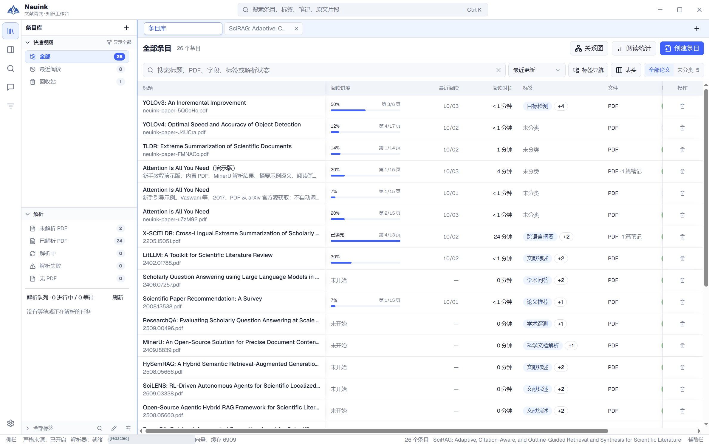
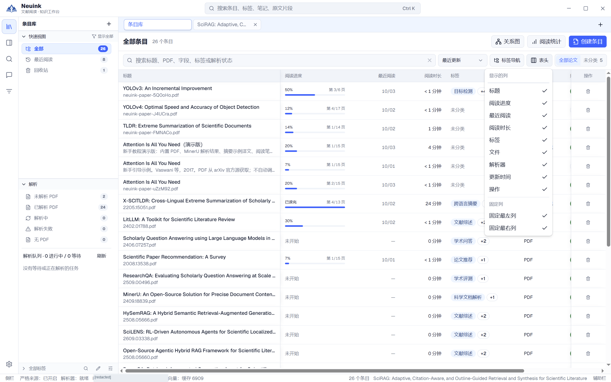
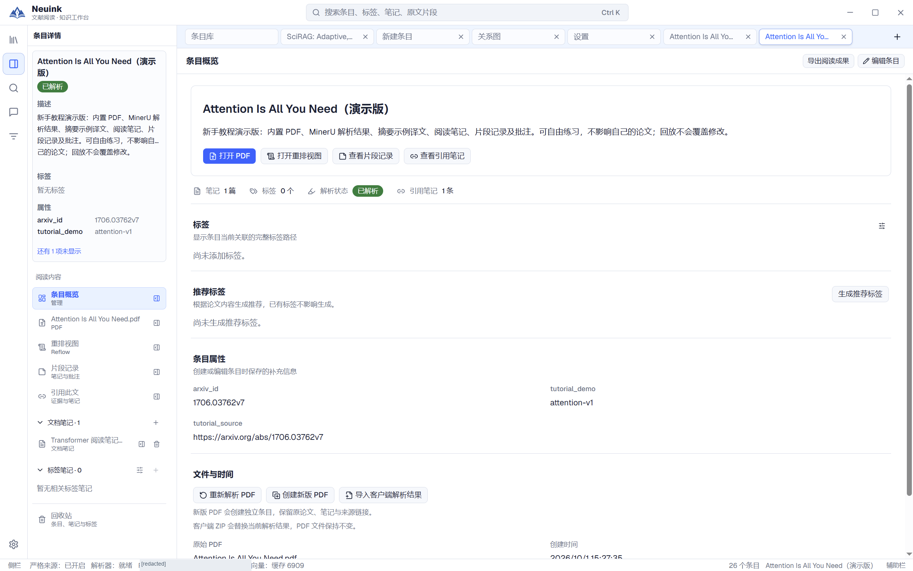

条目是资料的管理单位。它可以包含 PDF、解析结果、译文、批注、片段记录和多篇文档笔记；标签则让同一条目出现在不同研究主题下。

## 按步骤看实际界面

完整窗口截图可点击放大；先看入口，再按图下说明检查结果。服务地址与私人路径已遮挡。

### 1. 打开资料库列表

从左侧资料库入口进入列表，先核对当前范围。表格同时显示题名、标签、解析状态和阅读进度。

### 2. 按需要显示列

打开列表右侧的列设置，勾选需要比较的字段。此图保留了菜单与背后的列表，方便找到入口。

### 3. 查看一篇论文的概览

进入条目概览，核对标题、说明、属性和文件操作。PDF、解析结果与阅读成果都属于同一条目。

## 条目概览与元数据

从论文的概览进入“编辑条目”，修改标题、描述、标签和自定义属性。属性适合记录年份、方法、数据集或阅读用途等信息，不必把所有分类都塞进标题。

“文件与时间”区域管理原 PDF、创建新版 PDF和导入解析结果。没有 PDF 的元数据条目可以之后再附加文件。外部搜索只获得元数据时，不要把它误认为已经下载全文。

编辑中的元数据与解析任务状态分别更新：解析进度变化不应覆盖正在输入的草稿；如果另一处已经修改同一条目，需先解决冲突，再保存。

## 列表与书架

条目库支持表格列表与书架展示。表格便于比较字段和排序，书架便于按封面浏览。切换展示方式复用当前筛选范围，不会复制条目或改变数据。

阅读进度、页码、时长和笔记数量帮助你找回阅读上下文。阅读统计反映应用实际记录的活动，不代表已经理解全文或完成学术质量评估。

## 层级标签与范围

标签可以有父子层级，也可以写描述，说明这个主题的纳入标准。例如“机器学习 / 序列建模”可与“阅读用途 / 组会”同时赋给一篇论文。

选择标签后，注意“仅当前”与“含子标签”的范围。父标签下的累计成员不等于每篇论文都被显式赋予父标签；关系图会区分真实归属和层级关系。

把论文拖到标签行用于增加归属。删除某个标签与删除论文是不同操作；归档标签时，相关笔记与阅读状态有恢复路径。

## 标签笔记栏目

在标签范围内切换“论文 / 标签笔记”，可以直接建立该主题的综合笔记。标签描述用于说明分类本身，标签笔记用于持续积累研究内容。

条目详情会显示与当前论文相关的标签笔记，包括归属标签及引用这篇论文的笔记。查看[笔记类型](notes.md)了解它们与文档笔记的区别。

## 推荐标签

在条目概览或 PDF 工具条显式生成推荐标签，检查推荐路径后选择添加。已有标签会标为已添加；推荐结果不是实际归属，只有成功添加才改变分类。

结果在当前机器按资料库和条目缓存。重新打开或添加部分标签不会自动清空，重新生成成功后才替换旧结果；失败时保留上次结果。推荐是模型辅助操作，依赖可用的模型配置。

## 删除与恢复

先从回收站确认对象类型，再恢复条目、笔记或归档标签。标签恢复可能因同名、父标签缺失或关系已被修改而拒绝，应用不会静默覆盖新的分类。

永久删除是独立且不可当作“取消归属”的操作。想让论文离开某个主题，修改标签即可。更多数据边界见[数据与恢复](data.md)。
