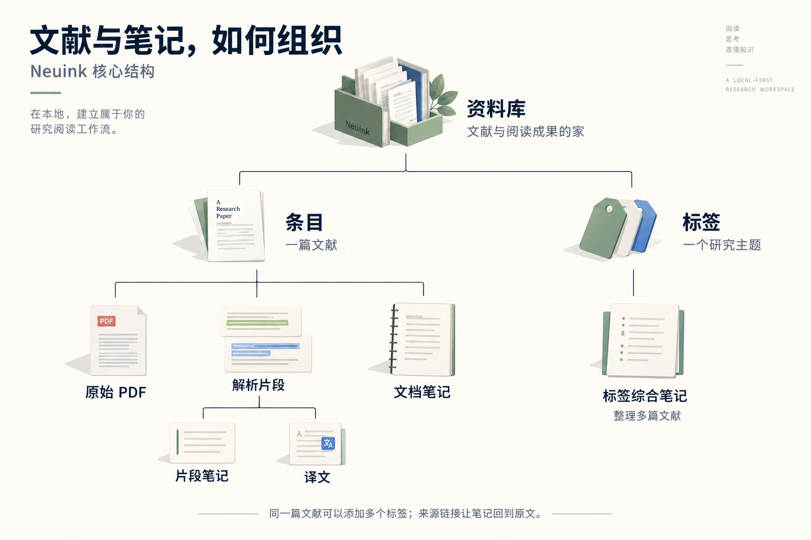
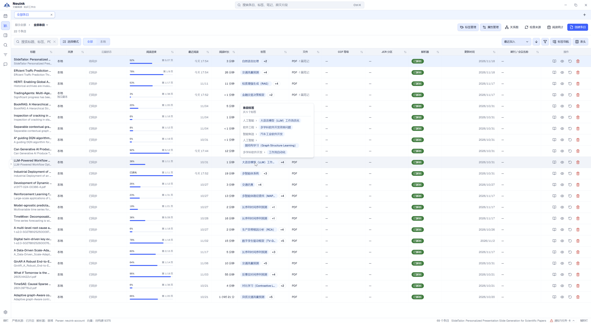
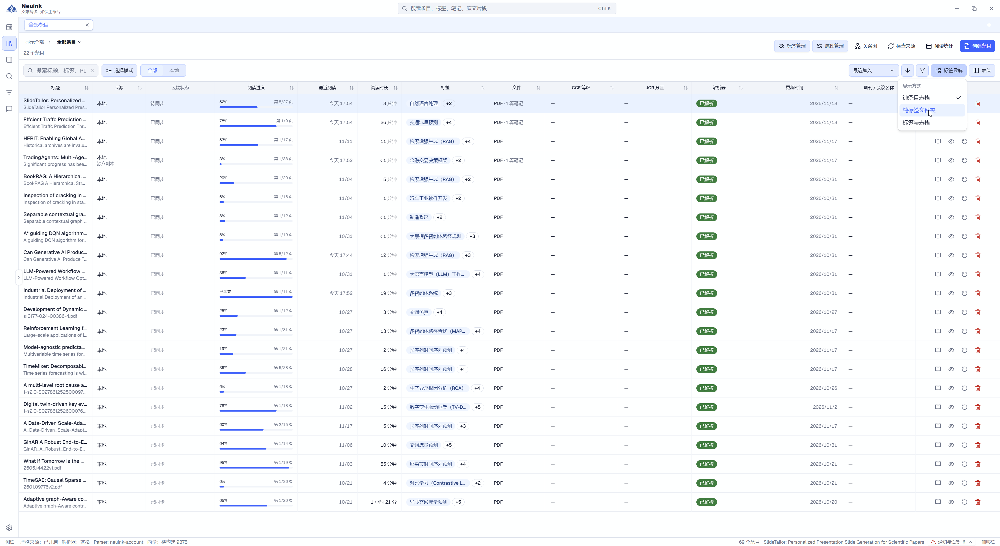
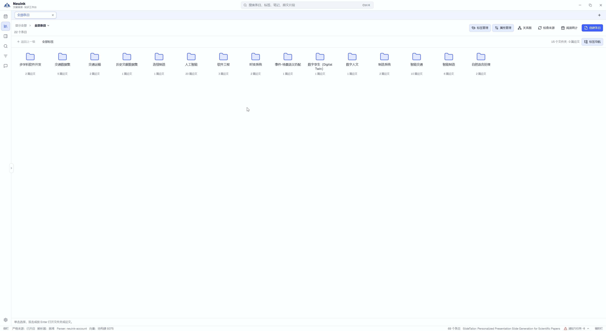
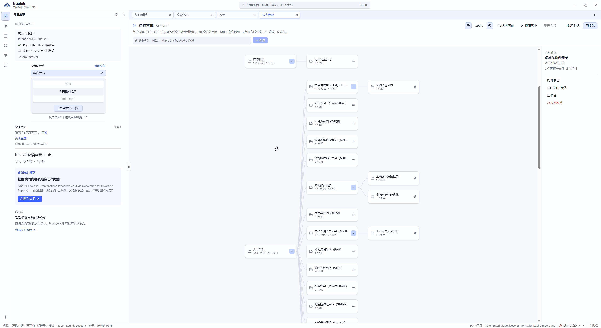
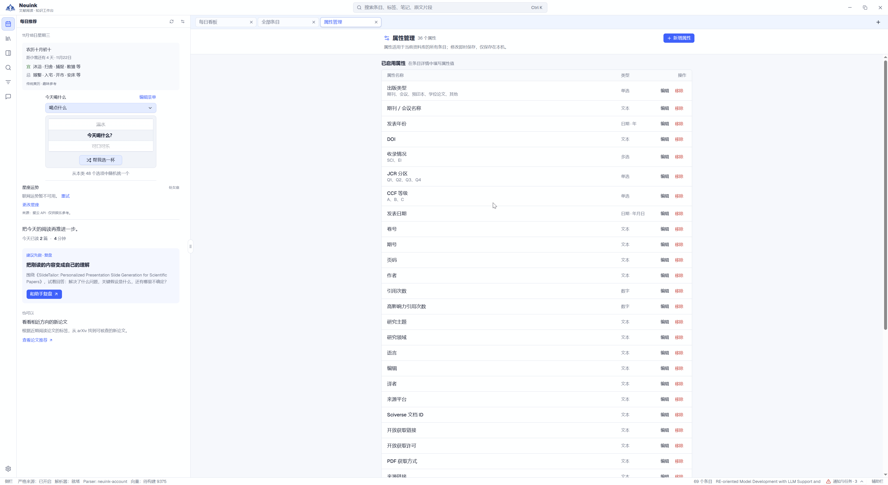
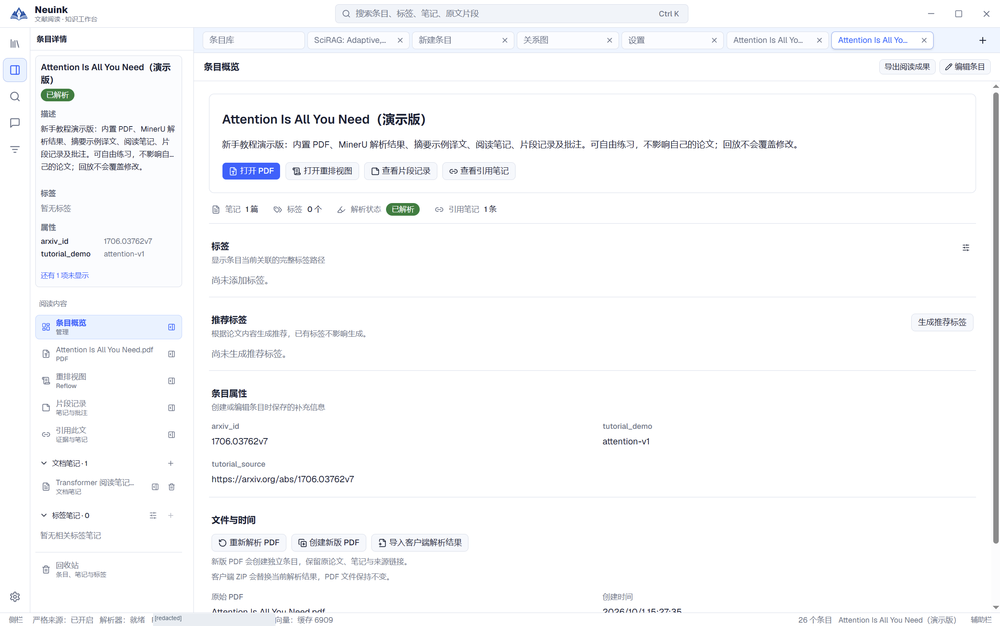

条目是资料的管理单位。它可以包含 PDF、解析结果、译文、批注、片段记录和多篇文档笔记；标签则让同一条目出现在不同研究主题下。

## 资料库、条目与标签的区别

把一篇文献建成一个条目，再用标签把它加入不同主题。归入多个标签无需重复导入 PDF。图示不是磁盘目录结构，更多说明见[核心概念](concepts.md)。

## 一张表看清资料状态

条目表格可以并排查看题名、阅读进度、时间、标签、属性和云端状态。标签适合组织主题，属性适合比较每篇资料的信息。

## 按任务选择表格或文件夹

“标签导航”提供纯条目表格、纯标签文件夹和标签与表格三种方式。切换展示不改变资料归属。

## 统一管理标签与属性

“标签管理”和“属性管理”分别打开独立页面。标签定义主题层级；属性定义整个资料库的字段、类型和可选项，在条目详情或表格中填写每篇论文的值。

## 查看一篇论文的概览

条目概览集中放置元数据、阅读内容和文件操作。以下保留较早版本的概览示例，当前属性定义请从独立属性管理进入。

## 条目概览与元数据

从论文的概览进入“编辑条目”，修改标题、描述、标签和属性值。这里编辑的是当前论文的内容；资料库有哪些属性，由单独的“属性管理”页面统一决定。

“文件与时间”区域管理原 PDF、创建新版 PDF和导入解析结果。没有 PDF 的元数据条目可以之后再附加文件。外部搜索只获得元数据时，不要把它误认为已经下载全文。

编辑条目后选择保存，或放弃本次修改；条目属性编辑不保留恢复草稿。如果另一处已经修改同一条目，需先解决冲突，再保存。

## 属性管理：为整个资料库定义字段

条目库工具栏的“属性管理”打开独立页面，与标签管理并列。系统已带常用发表信息，包括出版类型、期刊／会议名称、发表年份、DOI、作者，以及 JCR 分区、CCF 等级等评价字段。可按自己的资料增加属性，不需要先选择某篇论文。

| 类型 | 使用示例 |
| --- | --- |
| 文本 | 期刊／会议名称、研究方法、出版社。 |
| 数字 | 引用次数、样本数量。 |
| 日期 | 发表年份只填年；也可选择精确到年月或年月日。 |
| 单选 | 出版类型，或 CCF 的 A、B、C。 |
| 多选 | 收录情况，或自定义的研究特征。 |
| 是否 | 是否开放获取。 |

新增属性时设置名称与类型，单选和多选在选项列表中逐项添加、删除、拖动排序。已经有条目填写的属性，不能随意改变类型、日期精度，或删除正在使用的选项。移除属性需要确认，先阅读界面说明对已有值的影响。

标签适合组织主题层级；属性适合比较每篇论文的固定信息。把论文归入“机器学习”标签和填写“发表年份”，是两种不同操作。

## 在表格中直接改属性值

在表头设置中显示所需属性列，点击单元格即可编辑。单选、多选和是否使用对应选项，选择变更后直接保存，不需要额外点保存按钮；使用“留空”可以清除该值。文本、数字和日期按 Enter 或点击其他位置自动保存，按 Esc 放弃本次输入。

来源缓存保持来源身份，不能当作普通本地论文任意修改。需要独立维护时，先明确导入为本地副本。

## 在线查找并填充空白属性

在编辑条目时点击“在线查找属性”，按标题或 DOI 搜索 arXiv 和 Crossref。核对标题、作者与年份后，选择“填充空白”，检查结果并保存条目。

目前支持补充匹配的发表年份、DOI、论文链接，以及 arXiv 预印本类型；只处理已启用、类型兼容的空白属性，不覆盖已有值。JCR 分区、SCI/EI 收录与 CCF 等级需要自己核对填写，不由搜索结果推断。外部服务可能返回不完整结果。

Sciverse、Zotero 等已知来源字段会映射到中文名称，例如 year → 发表年份、publicationTitle → 期刊／会议名称。未知自定义字段保留；中英文同名字段内容冲突时不会直接丢弃其中一份。

## 当前范围与快捷切换

顶部条目库标签页会随当前内容显示“最近阅读”“回收站”或所选标签等名称。悬停标签页可查看快速切换入口；切换范围不需要另开一个条目库。

页眉中的长路径会截断，可悬停查看完整名称。右侧按钮按可用宽度显示，放不下的收进“更多”，不会为这些按钮增加横向滚动条；扩大窗口后会恢复直接显示。

## 列宽、固定列与操作

点击工具栏的表头按钮打开设置对话框。在其中按住左侧手柄拖动列顺序，或使用移到最前等快捷操作；标题和操作列保留固定位置。这里也可选择显示哪些属性。排序在对话框中完成，无需拖动表格表头。

表头边缘可拖动调整列宽，包括左右固定列；固定边界与拖动位置对齐。操作列优先显示能放下的按钮，宽度不足时把剩余操作收进“更多”，展开后保留统一菜单样式。选择模式聚焦搜索与批量操作，暂时隐藏无关工具。

在列设置开启“云端状态”，即可区分来源缓存、未开启同步、待同步、已同步、冲突和需要处理。“已同步”基于服务器确认，不等于全部资料都已备份，详见[同步状态说明](sync.md)。

表格、视图选择、标签与属性管理使用当前完整窗口截图；条目概览单独保留较早版本示例。

## 三种浏览方式

打开工具栏的“标签导航”菜单，选择适合当前任务的视图：

| 显示方式 | 适合的用法 |
| --- | --- |
| 纯条目表格 | 集中查看论文和字段，不显示标签文件夹区域。 |
| 纯标签文件夹 | 按主题逐层浏览，关闭下方表格，在文件夹内直接打开论文。 |
| 标签与表格 | 上方浏览标签，下方比较和筛选论文。 |

选择保存在本机；切换视图不会复制论文或修改标签归属。回收站仍使用自己的恢复列表。

### 像浏览文件夹一样找论文

单击选中文件夹或论文，双击或按 Enter 打开。工具栏提供“返回上一级”、当前位置路径和当前层级的文件夹／论文数量；点击路径可回到任意上级，根目录不再向上。

当前文件夹展示**直接归属该标签**的论文，子标签下的论文留在相应子文件夹；根目录展示未分类论文。没有下一级标签时仍可看到本层论文，无需切回表格。纯文件夹模式不沿用隐藏的文字搜索和来源下拉筛选条件，来源显示／隐藏规则仍然有效。

这里的文件夹是标签层级，不是磁盘目录。同一论文可属于多个主题，不会因此产生多个 PDF 副本。

## 列表与书架

表格便于比较字段和排序。使用提供书架入口的外观风格时，也可按封面浏览；该入口随当前风格而定。切换展示方式复用当前筛选范围，不会复制条目或改变数据。

阅读进度、页码、时长和笔记数量帮助你找回阅读上下文。阅读统计反映应用实际记录的活动，不代表已经理解全文或完成学术质量评估。

## 层级标签与范围

标签可以有父子层级，也可以写描述，说明这个主题的纳入标准。例如“机器学习 / 序列建模”可与“阅读用途 / 组会”同时赋给一篇论文。

选择标签后，注意“仅当前”与“含子标签”的范围。父标签下的累计成员不等于每篇论文都被显式赋予父标签；关系图会区分真实归属和层级关系。

把论文拖到标签行用于增加归属。删除某个标签与删除论文是不同操作；归档标签时，相关笔记与阅读状态有恢复路径。

## 标签笔记栏目

在标签范围内切换“论文 / 标签笔记”，可以直接建立该主题的综合笔记。标签描述用于说明分类本身，标签笔记用于持续积累研究内容。

条目详情会显示与当前论文相关的标签笔记，包括归属标签及引用这篇论文的笔记。查看[笔记类型](notes.md)了解它们与文档笔记的区别。

## 推荐标签

在条目概览或 PDF 工具条显式生成推荐标签，检查推荐路径后选择添加。已有标签会标为已添加；推荐结果不是实际归属，只有成功添加才改变分类。

结果在当前机器按资料库和条目缓存。重新打开或添加部分标签不会自动清空，重新生成成功后才替换旧结果；失败时保留上次结果。推荐是模型辅助操作，依赖可用的模型配置。

## 删除与恢复

先从回收站确认对象类型，再恢复条目、笔记或归档标签。标签恢复可能因同名、父标签缺失或关系已被修改而拒绝，应用不会静默覆盖新的分类。

永久删除是独立且不可当作“取消归属”的操作。想让论文离开某个主题，修改标签即可。更多数据边界见[数据与恢复](data.md)。
