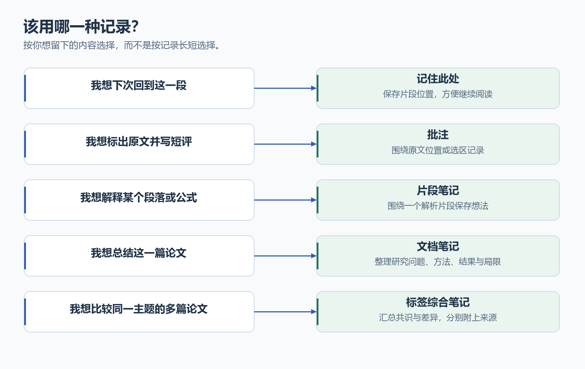
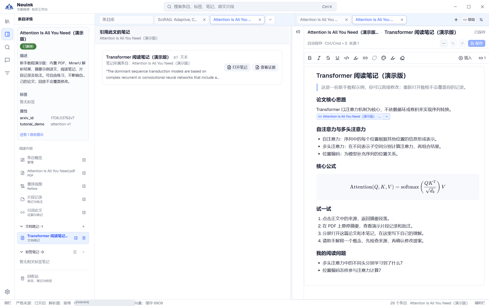
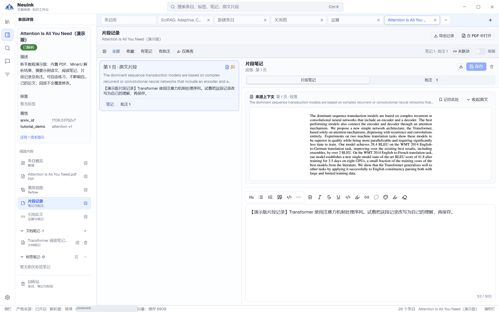
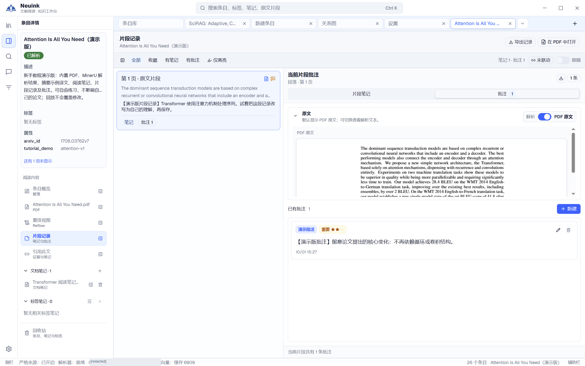

不是每一条阅读记录都需要一篇长笔记。先选择合适的记录类型，之后检索、对照与导出会更清楚。

## 先选适合自己的记录方式

只想找回位置，用“记住此处”；总结单篇论文，用文档笔记；比较多篇论文，用标签综合笔记。下面再按对应入口操作。

## 按步骤看实际界面

按下面的步骤找到入口，并检查操作结果；点击图片可放大查看。

### 1. 打开文档笔记编辑器

从条目下的文档笔记进入编辑器，使用标题、列表、公式与来源组织阅读理解。检查右上角保存状态。图中为既有演示笔记。

### 2. 查看某一片段的记录

打开“片段记录”，在同一画面核对原文片段和对应笔记。片段笔记与整篇文档笔记分别管理。

### 3. 切换到批注

在片段记录中查看批注内容及对应原文。先确认选中的片段，再决定修改或导出；编辑后请确认保存成功。

## 四种记录怎样选择

| 类型 | 归属 | 用途 |
| --- | --- | --- |
| 文档笔记 | 一篇条目 | 精读总结、方法推导、实验复现计划，可有多篇。 |
| 标签综合笔记 | 一个标签 | 汇总多个条目的共识、差异和研究方向。 |
| 片段笔记 | 解析片段 | 针对一个段落、表格或公式记下理解。 |
| 批注 | 原文位置或选区 | 保存高亮与紧贴原文的评论。 |

“记住此处”是片段收藏状态，用于下次定位，可以与笔记和批注一起使用。

## 创建与编辑长笔记

从条目详情新建文档笔记；从条目库的标签笔记栏目或同标签侧栏建立综合笔记。明确输入标题并创建后才形成文件。

编辑器支持标题、列表、任务列表、引用、代码、链接、图片、表格、数学公式及 Mermaid。长笔记可打开左侧目录并按标题跳转。表格和大图的阅读、编辑不要求将整份文档横向撑开。

可以使用格式工具条，也可以按 Markdown 习惯输入。科学图或公式要先核对渲染结果；Mermaid 语法正确不代表研究逻辑正确。

## 图片与来源资源

笔记可以包含粘贴或导入的图片，也可以引用解析片段中的图像。来源链接与普通网址不同：前者记录论文、片段和快照，后者指向外部地址。

迁移资料库时应保留相邻资源目录及来源数据。只复制一个内部 Markdown 文件可能丢失图片或来源能力；对外分享优先使用[导出](export.md)。

## 保存、自动保存与编辑权

留意“未保存、保存中、已保存、失败”的实际状态。使用 Ctrl/Cmd+S 保存；自动保存状态以编辑器当前提示为准，看到“已保存”后再关闭编辑页。

同一笔记在多个视图中打开时，应用管理编辑权，某一处可能只读。只读视图不能充当来源插入目标。另一处修改后发生冲突，应重新核对版本，不静默覆盖。

## 片段记录与批注

从选区、片段菜单或片段记录页进入对应编辑。片段记录可以按实际片段定位，跨页逻辑片段可能共用记录。批注和笔记要等保存成功，不能仅凭列表刷新判断已保存。

打开片段记录的方式可设置为选中后操作、单击或 Alt+单击；点击空白与再次点击当前片段是否关闭浮层也可配置。

## 删除与恢复

通过相应回收站恢复已删除内容。标签归档时，综合笔记保留但不可编辑；恢复标签后重新可用。恢复或永久删除前，请核对回收站中选中的对象类型和名称。

## 笔记与 AI 的边界

助手可提出文档笔记和片段笔记修改，先预览再应用。标签综合笔记目前仍以本地编辑为主，暂不支持作为助手附件或由助手直接修改。若希望先用 AI 梳理内容，可在受支持的上下文中取得带来源回答，再由你核对后整理。
