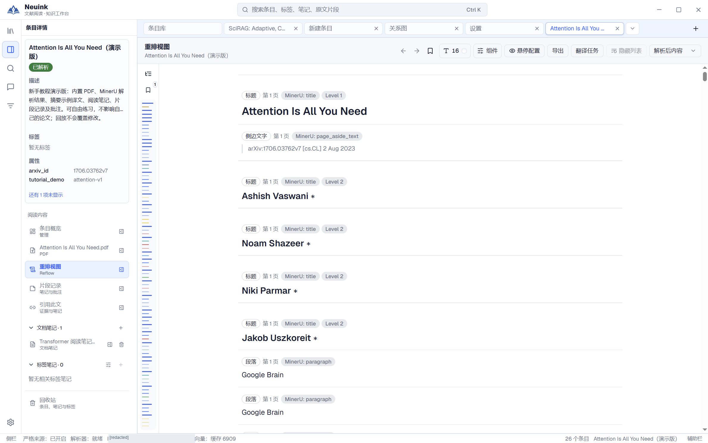
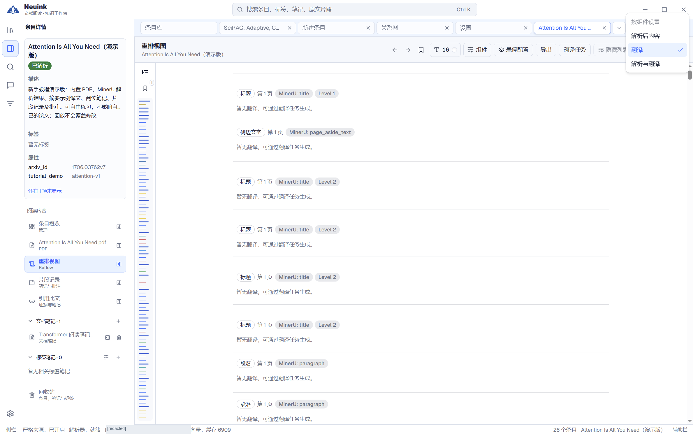
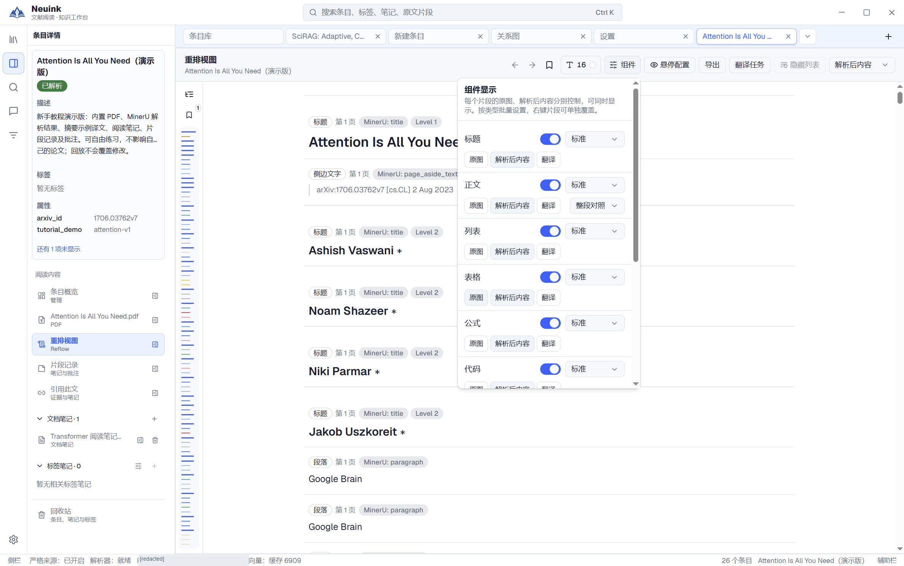

重排视图把解析结果变成适合屏幕阅读的连续内容，尤其适合双栏论文和窄分屏。它是从解析数据生成的阅读视图，不能替代原页的科学证据。

## 按步骤看实际界面

按下面的步骤找到入口，并检查操作结果；点击图片可放大查看。

### 1. 打开重排视图

从条目详情选择“重排视图”，阅读解析后的标题、段落与结构内容。原 PDF 仍是核对依据。

### 2. 选择原文、译文或双语

打开顶部显示菜单，选择解析后内容、译文或双语。当前没有对应译文的区域可能为空，应先检查翻译状态。

### 3. 选择要显示的内容类型

展开阅读工具中的组件显示选项，控制标题、正文、列表、表格、公式等类型。菜单可滚动，隐藏某类型不会删除原内容。

## 支持的内容

重排呈现标题、正文、列表、表格、公式、代码、辅助文字、图片与图表。可用内容取决于 MinerU 实际输出；解析器没有识别出来的信息不会被阅读器自动补全。

公式使用可用的数学表示渲染，表格沿用解析结构。科学流程图若提供 Mermaid，可按对应展示模式阅读；图形渲染成功不等于图中逻辑已被验证。

## 内容显示与字号

在阅读视图的设置中调整正文字号、背景及各类内容的显示偏好。可以隐藏流程图或某类辅助内容，也可以调整图片／图表尺寸。

显示偏好只改变阅读界面，不删除源数据。完整全文导出不会因为你折叠段落、隐藏图片或滚动到某一处而只输出可见部分。

## 原图与解析内容

每个适用片段可独立选择显示原图、解析内容或相应组合。表格结构不可靠时，用原图核对列与数值；公式或流程图有疑问时，回到 PDF 页确认。

打开图片详情后，可放大与拖动查看；宽表格在局部区域滚动，不需要把全局界面缩得很小。图片在界面中保留，并不表示图片内部的英文已被翻译。

## 原文、译文和双语

翻译显示可选择原文、译文或双语对照；逐句对照等操作需要对应片段有可用译文，必要时触发翻译请求。没有译文、正在翻译和失败会有不同状态。

全文翻译与局部阅读翻译共用配置的阅读翻译模型。详见[翻译任务](translation.md)，尤其是暂停、继续以及旧译文的处理。

## 片段记录与来源

在段落旁查看或编辑对应的片段笔记、批注，使用来源操作连接到当前可编辑笔记。重排和 PDF 指向同一文献与解析片段，不需要分别维护两套笔记。

## 如何保持证据可靠

遇到正文顺序异常、表格丢列、缺图或公式缺项时，保留问题并核对原 PDF。导出检查会报告它能够检测到的缺项，但无法保证原 PDF 中所有信息都被解析出来；“所有已解析片段均已处理”不是“原文毫无遗漏”。
