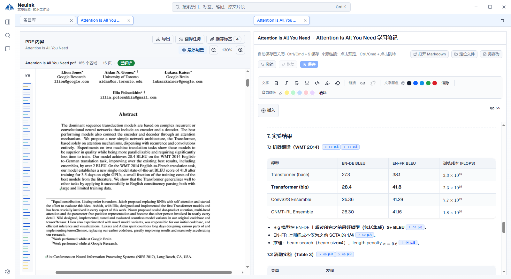

这些是仓库已有的 **Neuink 实机截图**，演示材料为《Attention Is All You Need》。截图只裁掉了底部包含服务地址的状态栏，没有重绘界面；具体按钮位置可能随版本变化。点击任意图片可打开原尺寸，在手机上也能放大阅读。

## 阅读与翻译：先找到原文，再看解释

1. **左侧条目详情**：上方是论文标题与解析状态，下方是 PDF、重排视图、片段记录和来源链接等入口。它们属于同一篇论文。
2. **右侧 PDF**：保留论文排版，蓝框对应当前片段；旁边的彩色竖条用于浏览片段位置。
3. **中间片段浮层**：同屏呈现解析原文和已有中文译文。先核对英文，再判断中文是否符合上下文。
4. **右上角工具栏**：可找到导出、翻译任务、悬停配置和缩放。配置翻译模型及内容范围后再启动翻译；图片中的译文不代表所有论文已自动翻译。

接着阅读：[PDF 原文阅读](pdf.md) · [翻译与双语对照](translation.md) · [导出与分享](export.md)。

## 分屏笔记：一边读，一边整理

1. **顶部两组标签**：左边打开 PDF，右边打开学习笔记；各自保留阅读位置。
2. **左侧原论文**：核对论述与上下文，不需要反复离开笔记页。
3. **右侧笔记编辑区**：文字、实验结果表格和列表组织在同一份笔记里。图中演示的是文档笔记，并不是标签综合笔记。
4. **蓝色页码小链接**：笔记中的结论连接到原文来源。单击可预览，Ctrl/Cmd + 单击可跳转；具体行为以当前界面提示为准。
5. **保存提示与工具条**：写完先检查保存状态，再进行导出或分享。图中已展示“自动保存已关闭”的提示，不能只因内容显示在编辑器里就认为已经保存。

接着阅读：[认识工作台](workspace.md) · [笔记、批注与收藏](notes.md) · [来源链接与反向引用](sources.md)。

## AI 助手：选好上下文，核对整理结果

1. **左侧助手顶部**：显示当前关联条目、模型选择和会话控制。图中的模型只是当时的配置，不是使用 Neuink 的唯一选择。
2. **左侧对话区**：可以查看助手整理的内容和引用；对证据不足的部分仍需回到原文核验。
3. **下方输入框**：输入问题，也可用 @ 添加上下文；发送前确认要让模型读取哪些资料。
4. **右侧学习笔记**：展示研究结果如何组织成自己的笔记，带有标题、列表、公式和来源链接。
5. **右上角保存操作**：图中笔记仍有未保存提示。修改提案的审阅与最终保存是不同步骤，不要把对话里的建议直接当作已落盘的成果。

接着阅读：[AI 助手与修改审阅](assistant.md) · [在线文献与网页检索](research.md)。

## 图片没有展示的部分

这组图片覆盖阅读、双语预览、分屏、文档笔记、来源和助手。关系图、资料库书架、设置及导出对话框尚未收录实机图，请以对应指南中的入口与操作说明为准；不使用其他页面截图冒充这些功能。
