Neuink 是一个本地优先的文献阅读与知识整理工作台。你可以把论文、报告和书籍章节放进资料库，在同一个窗口里阅读 PDF、查看重排与译文、记录想法，并将笔记中的结论连接到原文。需要进一步研究时，可以搜索已有资料，或让配置好的 AI 助手参与整理。

## 先理解概念，再找操作入口

[核心概念图解](concepts.md)解释内容层级、标签与论文的关系，以及不同笔记的用途；[第一次使用](start.md)给出从导入到导出的流程。已经熟悉系统时，可以直接按下方目录找步骤图。

## 先认识几个核心概念

| 概念 | 它是什么 | 什么时候用 |
| --- | --- | --- |
| 资料库（Workspace） | 保存在本地的一组文献与阅读成果。 | 按长期研究方向管理自己的资料。 |
| 条目（Entry） | 一篇文献的管理单位，包含标题、PDF、解析结果及相关笔记。 | 导入论文、补充属性、管理文件。 |
| 标签（Tag） | 可有父子层级的主题分类，一篇文献可属于多个标签。 | 汇集同一主题的论文，进行跨篇阅读。 |
| 片段（Segment） | 解析得到的段落、表格、公式或图片等内容单元。 | 定位证据、翻译某段、记录局部想法。 |
| 笔记（Note） | 文档笔记整理单篇论文，标签综合笔记整理跨篇主题。 | 把阅读转化成自己的理解。 |
| 来源链接（Source Link） | 将笔记连接到文献、页码、片段及引用快照。 | 检查某个结论的依据，返回原文核对。 |

## 从第一篇论文开始

1. **建立资料库**：在设置中打开或新建资料库，确定文件保存位置。
2. **导入 PDF**：创建条目并附加 PDF，先确认原文可以阅读。重排和片段功能需要再导入解析结果。
3. **边读边记**：将 PDF 与笔记分屏打开，写下问题、方法和结论，并添加来源。
4. **按需翻译与研究**：配置模型后使用翻译或助手；先核对上下文，再检查生成内容与出处。
5. **整理与分享**：用标签组织主题，搜索已有材料，最后选择笔记或全文导出。

下面按功能展示操作入口和界面。点击图片可以放大；完整的前置条件、操作方法和问题处理见各专题教程。

## 按任务找步骤图

| 教程 | 步骤图 | 可以看清什么 |
| --- | --- | --- |
| [资料库与条目](library.md) | 3 张 | 打开资料库列表、按需要显示列、查看一篇论文的概览 |
| [PDF 与解析结果导入](import.md) | 4 张 | 新建条目并选择 PDF、找到 MinerU 客户端路线、切换到 MinerU ZIP、对照 PDF 检查解析正文 |
| [PDF 原文阅读](pdf.md) | 2 张 | 打开原始 PDF、把文档笔记放到另一侧 |
| [重排与显示控制](reflow.md) | 3 张 | 打开重排视图、选择原文、译文或双语、选择要显示的内容类型 |
| [翻译设置与任务](translation.md) | 3 张 | 先指定阅读翻译模型、打开翻译任务面板、筛选已有译文 |
| [笔记、片段记录与批注](notes.md) | 3 张 | 打开文档笔记编辑器、查看某一片段的记录、切换到批注 |
| [来源追溯](sources.md) | 3 张 | 查找哪些笔记引用了本文、从反向引用查看证据、从笔记返回原文 |
| [标签阅读与主题范围](parallel.md) | 2 张 | 打开标签阅读侧栏、选择一个研究主题 |
| [本地搜索](search.md) | 1 张 | 输入术语并检查结果类型 |
| [关系图](graph.md) | 2 张 | 打开关系图总览、筛选要观察的关系 |
| [助手与上下文](assistant.md) | 2 张 | 确认模型和阅读对象、选择额外上下文 |
| [内嵌网页](browser.md) | 1 张 | 打开论文主页并确认关联对象 |
| [导出成果](export.md) | 3 张 | 检查全文导出范围、选择自己的阅读成果、选择合并文件或逐项打包 |
| [设置与模型连接](settings.md) | 5 张 | 调整外观与缩放、调整阅读交互、查看已有模型连接、填写新的模型连接、选择研究工具 |
| [资料库管理](data.md) | 1 张 | 找到打开、新建与迁移入口 |

## 完整操作画面

下面按操作顺序收录各功能的操作截图。需要功能边界、异常处理或操作后检查方法，请进入各组的详细教程。

## 资料库与条目

[打开详细教程](library.md)。

### 打开资料库列表

从左侧资料库入口进入列表，先核对当前范围。表格同时显示题名、标签、解析状态和阅读进度。

### 按需要显示列

打开列表右侧的列设置，勾选需要比较的字段。调整后返回列表，确认需要的列已经显示。

### 查看一篇论文的概览

进入条目概览，核对标题、说明、属性和文件操作。PDF、解析结果与阅读成果都属于同一条目。

## PDF 与解析结果导入

[打开详细教程](import.md)。

### 新建条目并选择 PDF

在新建条目页填写标题，选择 PDF，再检查说明和标签。截图为尚未提交的表单；选择文件之后才进行创建。

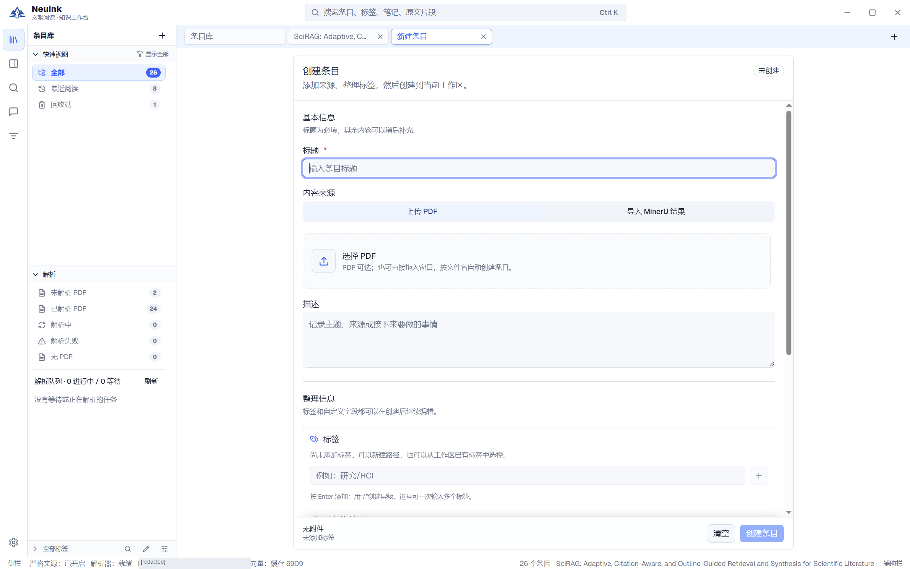

### 找到 MinerU 客户端路线

打开设置中的“导入与解析”，查看推荐客户端的图文教程。客户端生成结果后返回 Neuink。

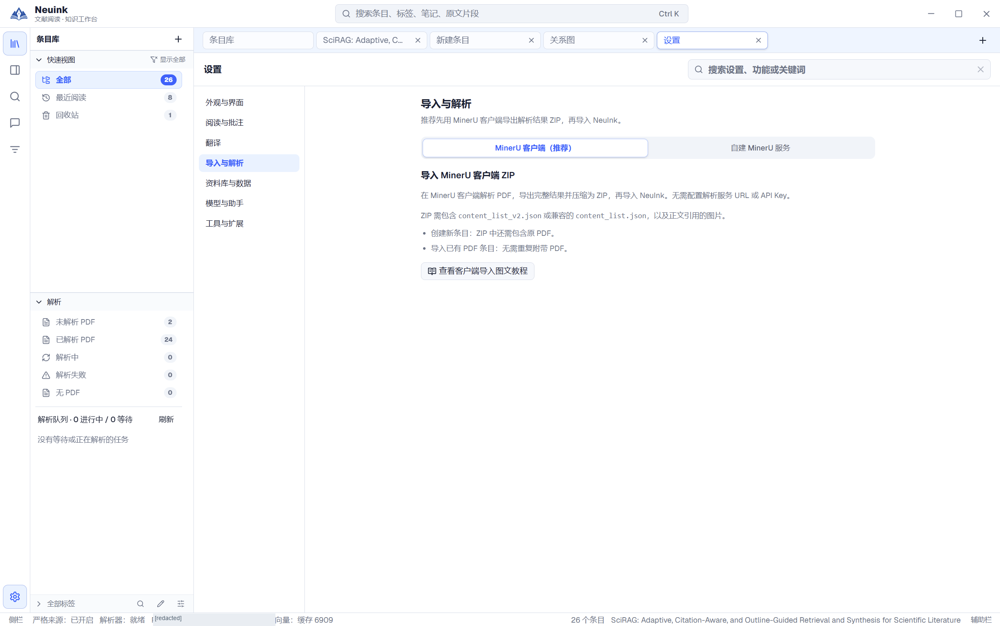

### 切换到 MinerU ZIP

在新建条目页选择 MinerU ZIP 入口，上传完整解析结果包。新条目还需按表单要求提供原 PDF。

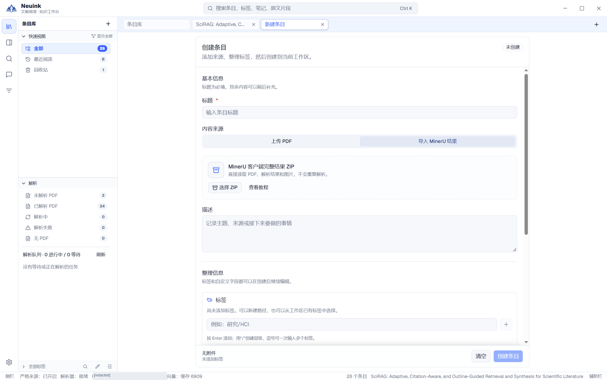

### 对照 PDF 检查解析正文

完成导入后，在两侧分别打开重排与 PDF，核对段落、页码及图表。使用自己的文献时，也请完成这一步核对。

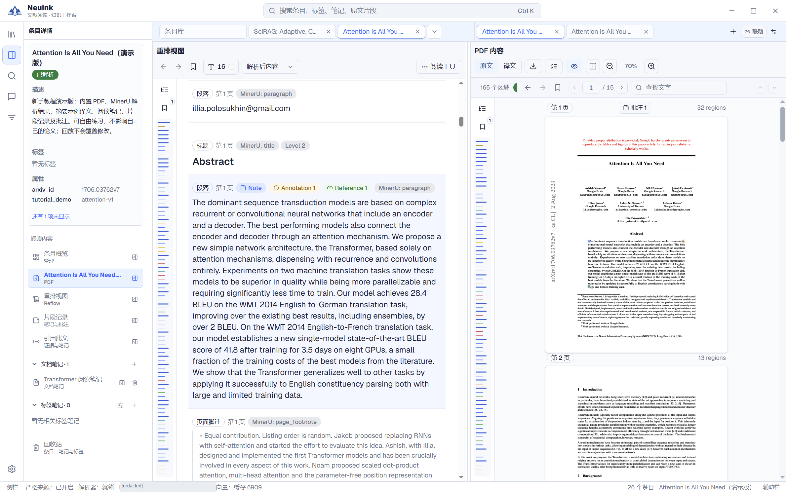

## PDF 原文阅读

[打开详细教程](pdf.md)。

### 打开原始 PDF

从条目详情选择 PDF。上方工具栏管理原文／译文、导出、翻译任务和缩放；页码与片段导航在其下方。

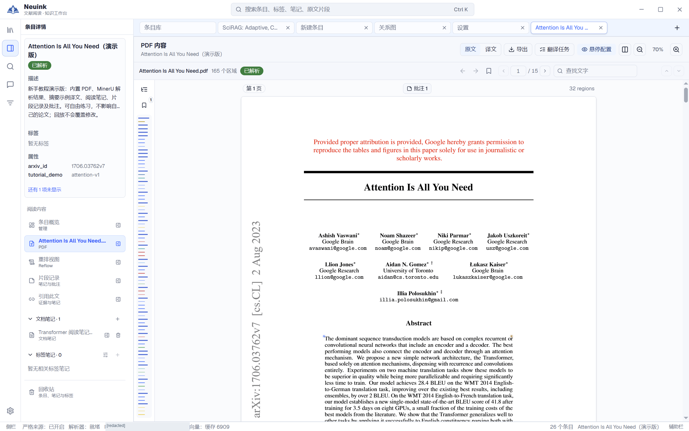

### 把文档笔记放到另一侧

使用笔记旁的分屏入口，左边保留 PDF，右边查看或编辑笔记。两个阅读区各自滚动，分屏不是 PDF 的双页模式。

## 重排与显示控制

[打开详细教程](reflow.md)。

### 打开重排视图

从条目详情选择“重排视图”，阅读解析后的标题、段落与结构内容。原 PDF 仍是核对依据。

### 选择原文、译文或双语

打开顶部显示菜单，选择解析后内容、译文或双语。当前没有对应译文的区域可能为空，应先检查翻译状态。

### 选择要显示的内容类型

展开阅读工具中的组件显示选项，控制标题、正文、列表、表格、公式等类型。菜单可滚动，隐藏某类型不会删除原内容。

## 翻译设置与任务

[打开详细教程](translation.md)。

### 先指定阅读翻译模型

在设置的“翻译”页选择模型，分别核对自动翻译开关、内容类型和显示偏好。

### 打开翻译任务面板

从阅读器工具栏进入翻译任务，核对片段总数、翻译范围与当前状态，再决定启动或继续。演示条目预置了 1 个译文，可用来熟悉任务状态与筛选。

### 筛选已有译文

切换到“已翻译”查看实际保存的片段。不要把一个片段完成理解成整篇完成；返回重排后再选择双语显示。

## 笔记、片段记录与批注

[打开详细教程](notes.md)。

### 打开文档笔记编辑器

从条目下的文档笔记进入编辑器，使用标题、列表、公式与来源组织阅读理解。检查右上角保存状态。图中为既有演示笔记。

### 查看某一片段的记录

打开“片段记录”，在同一画面核对原文片段和对应笔记。片段笔记与整篇文档笔记分别管理。

### 切换到批注

在片段记录中查看批注内容及对应原文。先确认选中的片段，再决定修改或导出；编辑后请确认保存成功。

## 来源追溯

[打开详细教程](sources.md)。

### 查找哪些笔记引用了本文

在条目详情点击“引用此文”，查看引用笔记、页码与证据摘要。每条结果提供“打开笔记”和“查看证据”。

### 从反向引用查看证据

点击“查看证据”，另一侧打开 PDF 并定位对应原文区域。核对高亮段落与引用摘要是否一致。

### 从笔记返回原文

打开笔记并点击正文中的来源链接，左侧重排定位并突出显示摘要片段。这样可以从结论回到它引用的完整上下文。

## 标签阅读与主题范围

[打开详细教程](parallel.md)。

### 打开标签阅读侧栏

点击左侧标签阅读入口，查看标签、论文和标签笔记三个分组。展开论文可继续进入相应阅读内容。

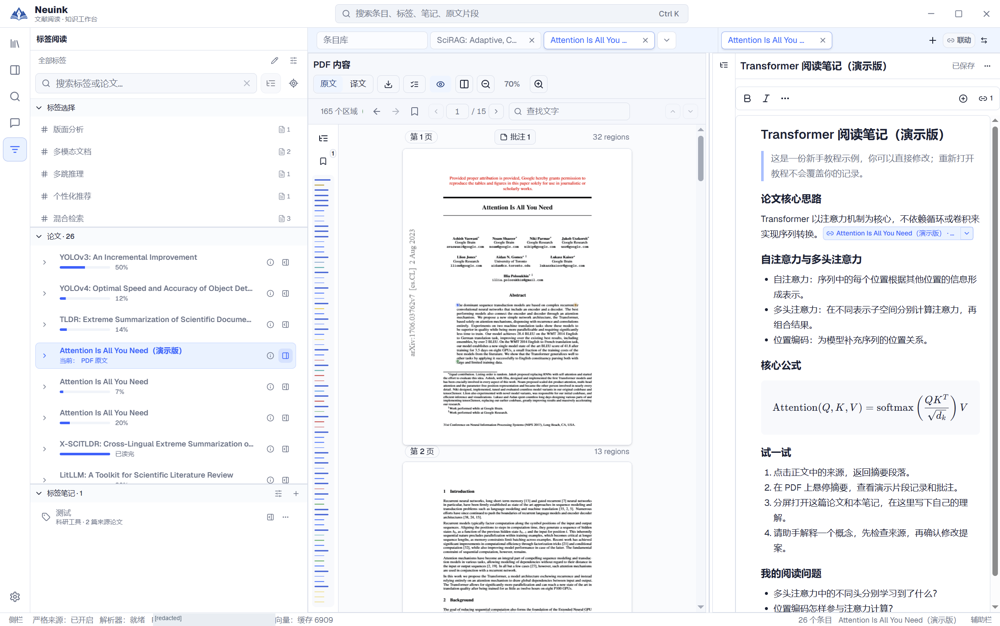

### 选择一个研究主题

点击“混合检索”标签后，论文列表缩小到该标签的 3 篇成员。中间原阅读对象仍保留，说明主题范围与当前页面分别管理。

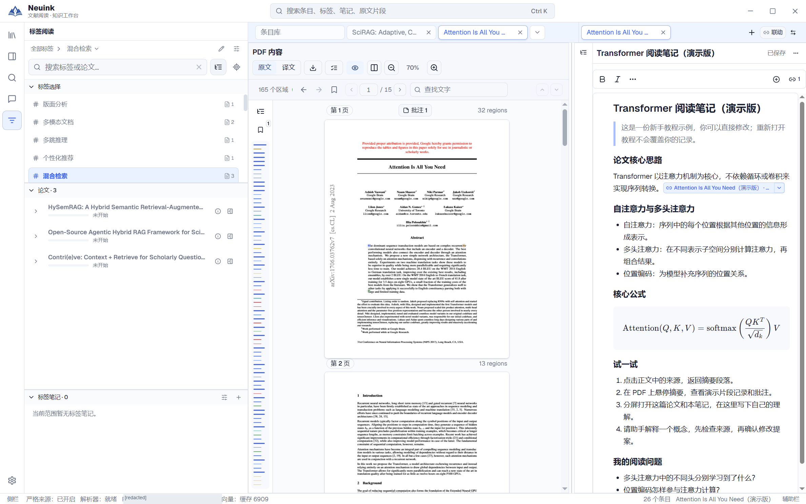

## 本地搜索

[打开详细教程](search.md)。

### 输入术语并检查结果类型

打开左侧搜索并输入 attention，选择 Hybrid 或 Keyword。结果同时标明字段、条目、PDF 片段与页面，点击前先看出处；上方可检查模型和索引状态。

## 关系图

[打开详细教程](graph.md)。

### 打开关系图总览

从资料库进入关系图，查看标签、论文和笔记之间已有的连接。节点与数量来自当前资料库，图形布局可能随数据变化。

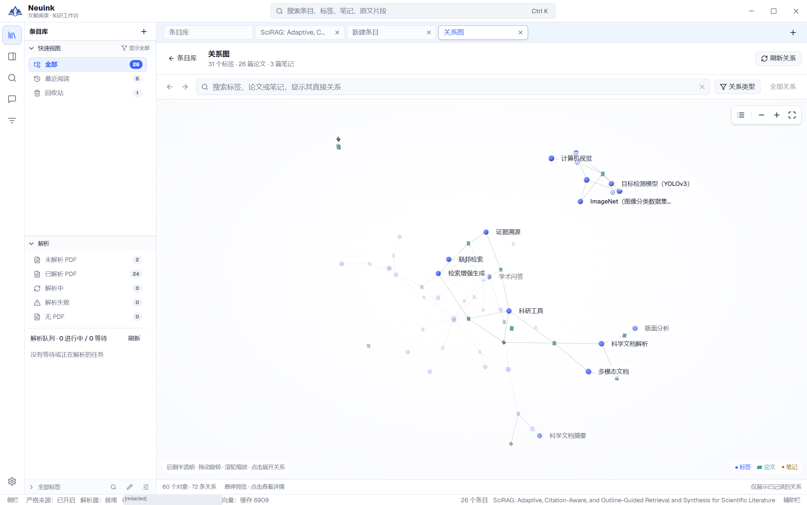

### 筛选要观察的关系

展开关系类型菜单，分别控制层级、归属、笔记与来源关系。先缩小范围，再查看具体节点，避免把所有连线都理解为引用。

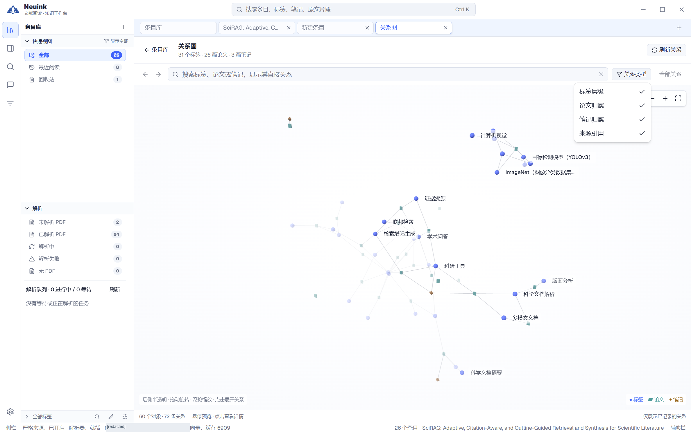

## 助手与上下文

[打开详细教程](assistant.md)。

### 确认模型和阅读对象

打开助手，检查顶部模型和底部阅读对象。图中关联演示论文，尚未发送问题；右边保留原文和笔记用于核对。

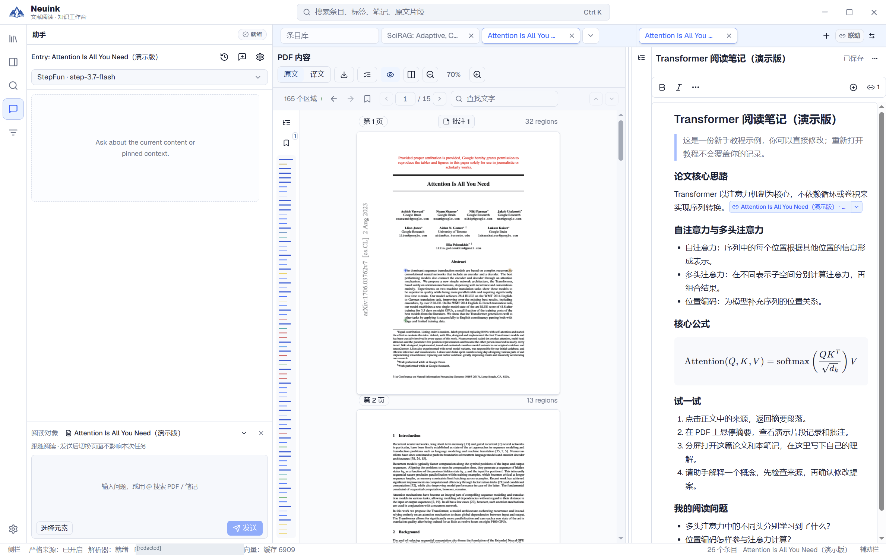

### 选择额外上下文

点击“选择元素”，按标签、条目、PDF 或笔记选择材料。核对范围后再输入问题并发送；发送前再次确认已选材料就是这次问题所需的范围。

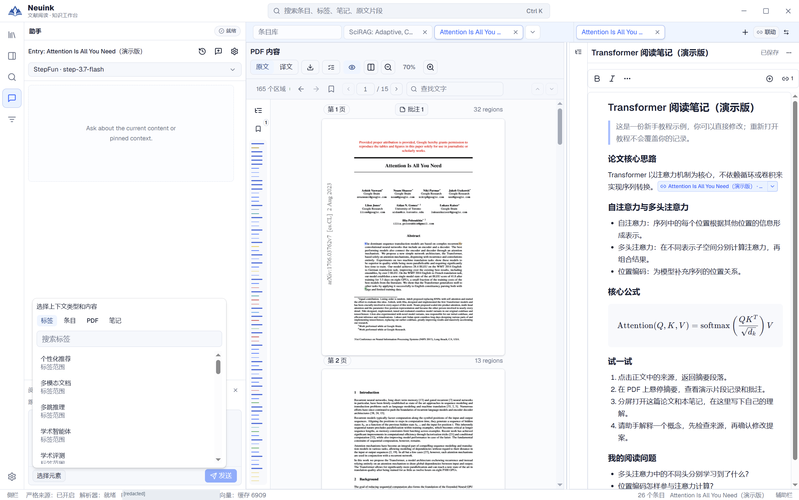

## 内嵌网页

[打开详细教程](browser.md)。

### 打开论文主页并确认关联对象

点击标签栏“＋”，输入公开论文网址并访问。图中 arXiv 页面已加载，助手的阅读对象变为当前网页；可一边查看网页一边整理笔记。

## 导出成果

[打开详细教程](export.md)。

### 检查全文导出范围

从 PDF 或重排的导出入口选择原文、中文或双语，等待内容检查并核对缺失项。图中为原文导出检查完成状态，尚未写出文件。

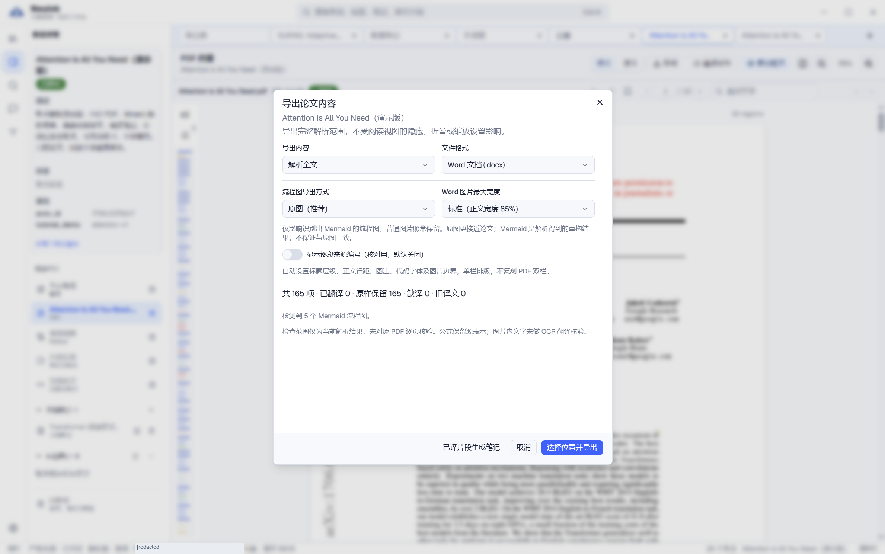

### 选择自己的阅读成果

从条目概览打开阅读成果导出，按类型和标题选择项目。图中还未勾选项目，空选择不会自动导出全部。

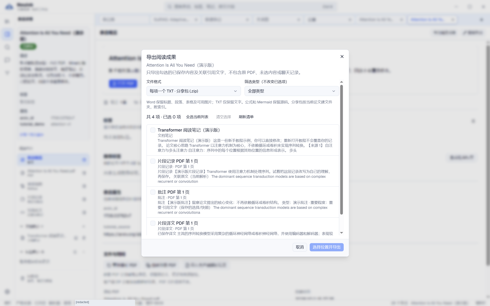

### 选择合并文件或逐项打包

展开格式菜单，选择 Word、TXT 或相应 ZIP。确认已选内容、格式与检查结果后再导出，并在目标软件中复核文件。

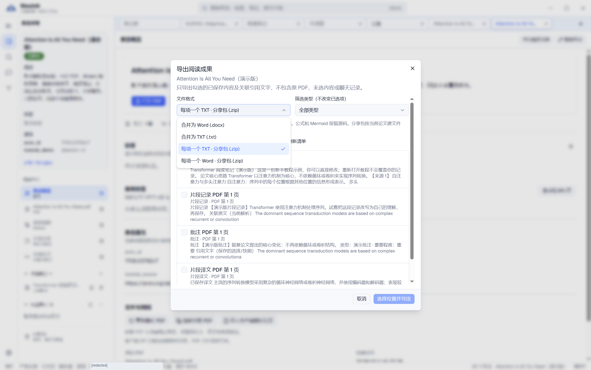

## 设置与模型连接

[打开详细教程](settings.md)。

### 调整外观与缩放

打开设置的“外观与界面”，选择界面风格、强调色与缩放。截图使用标准风格，其他风格的业务入口相同。

### 调整阅读交互

在“阅读与批注”中选择悬停预览及其内容。页面可继续滚动；截图展示当前可见的上部设置，不代表全部选项。

### 查看已有模型连接

进入“模型与助手”，检查模型列表及任务分工，再决定新增或编辑连接。截图未展开已有凭据。

### 填写新的模型连接

点击新增模型，按实际服务填写协议、模型、名称、Base URL 与密钥，测试后保存。截图是空白表单，没有可直接复用的密钥。

### 选择研究工具

在“工具与扩展”中核对论文和网页检索开关，以及可选服务配置。查看设置不会自动发起研究任务。

## 资料库管理

[打开详细教程](data.md)。

### 找到打开、新建与迁移入口

进入“资料库与数据”，查看当前库、新建／打开／迁移操作及新手引导。打开或新建资料库时选择保存目录；需要更换目录时再使用迁移。

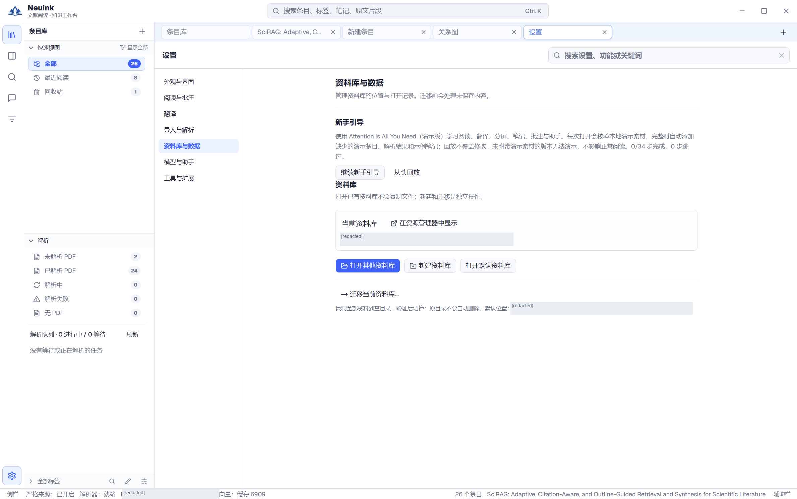

## 继续学习

第一次使用建议先阅读[入门指南](start.md)。解析准备见 [MinerU 导入](import.md)，AI 修改前的审阅见[助手指南](assistant.md)，资料迁移与恢复见[数据管理](data.md)。
