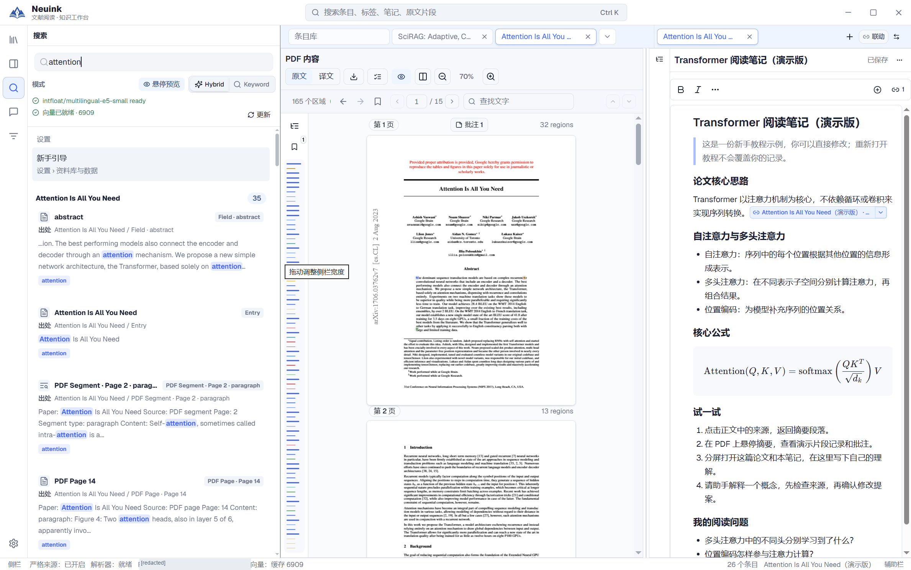

全局搜索面向当前本地资料库。先选择合适的搜索模式，再结合结果对象与证据范围判断相关性。

## 按步骤看实际界面

按下面的步骤找到入口，并检查操作结果；点击图片可放大查看。

### 1. 输入术语并检查结果类型

打开左侧搜索并输入 attention，选择 Hybrid 或 Keyword。结果同时标明字段、条目、PDF 片段与页面，点击前先看出处；上方可检查模型和索引状态。

## 三种搜索模式

| 模式 | 适合的问题 | 依赖 |
| --- | --- | --- |
| Keyword 关键词 | 找题名、术语、字段或记得的原句 | 本地关键词索引。 |
| Semantic 语义 | 用自己的描述找概念相近的内容 | 可用的本地 embedding 模型与索引。 |
| Hybrid 混合 | 同时考虑词面和语义相关性 | 关键词与语义两路结果；不可用时说明降级。 |

语义结果表示相近程度，不代表事实正确或证据强度。知道专有名词、DOI 或原句时，先尝试关键词往往更容易核对。

## 搜索覆盖哪些对象

支持条目、标签、字段、文档笔记、片段笔记、PDF 页面及解析片段等对象。条目元数据和文档笔记不依赖 PDF 解析；结构化片段需要有可用解析结果。

**标签综合笔记尚未纳入全局搜索**，请从标签笔记列表按标题筛选。未解析 PDF 的助手基础文字搜索是另一项工具，不能将它当作完整的全局全文索引。

## 看懂结果并回到上下文

输入搜索词后先看结果类型与摘要，打开对应条目、笔记或原文位置。匹配片段只是一部分证据；跨页表格或被截断段落，应打开完整阅读视图核对。

没有结果时先检查当前资料库和查询范围，再缩短术语或切换模式。不要用“没有搜到”证明论文从未提到某个问题。

## 本地语义模型

语义搜索使用可选的 `intfloat/multilingual-e5-small` 兼容资源。发行包可能携带，也可能需要按构建说明准备；应用不会在运行时静默下载。

模型缺失时基础阅读、笔记和关键词搜索仍可用。界面会说明语义不可用或降级，不能把降级后的结果称为真正语义结果。

## 索引与缓存

搜索索引是从用户文件派生的缓存，可以重建。解析、笔记和条目变化会影响索引状态，任务面板可以显示相关进度。重建索引不应被理解为恢复已永久删除的用户文件。

结果过旧或缺项时，先核对原内容是否已经保存、解析是否完成、索引是否仍在处理。先恢复业务数据，再处理缓存问题。

## 与在线检索的区别

本地搜索查自己的资料库；助手的论文与网页检索向外部服务请求公开候选。在线候选不会因为出现一次就自动成为本地条目，需要确认添加，详见[在线研究](research.md)。
