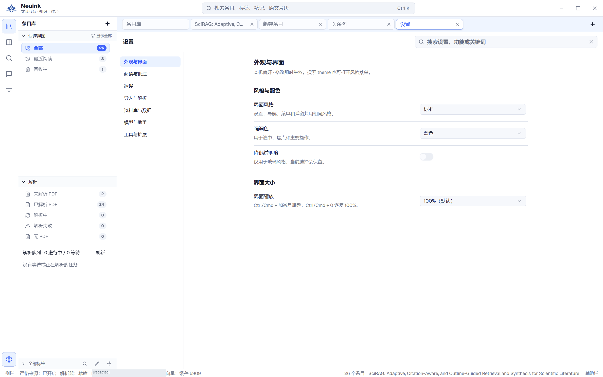
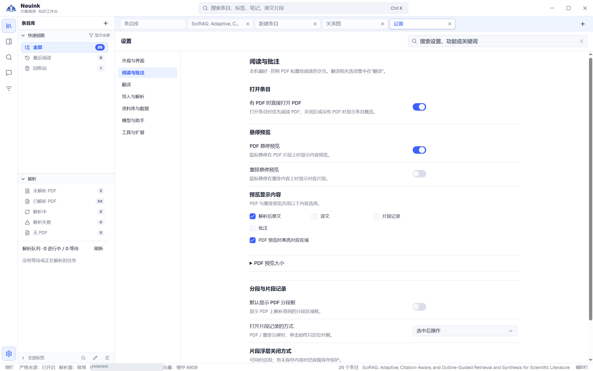
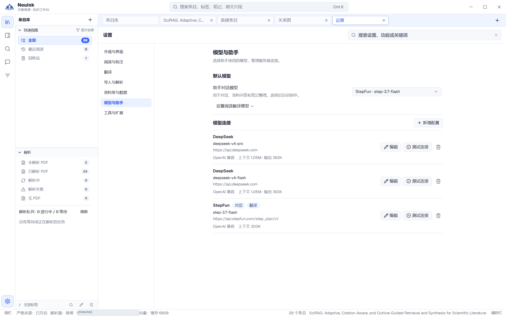
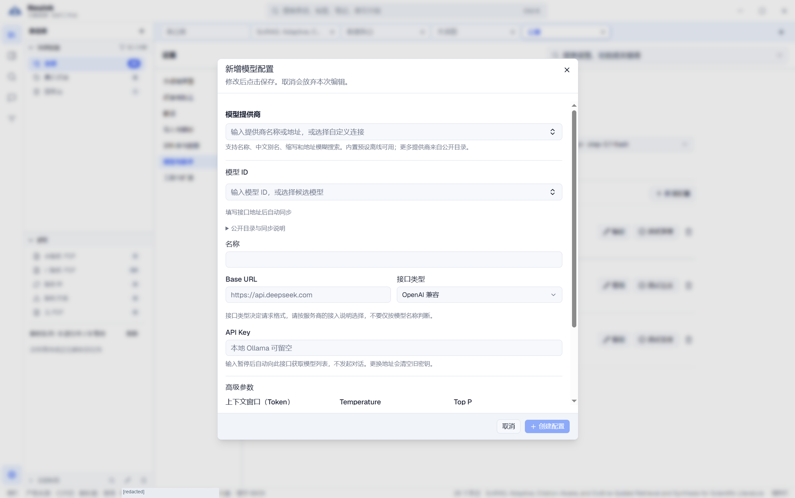
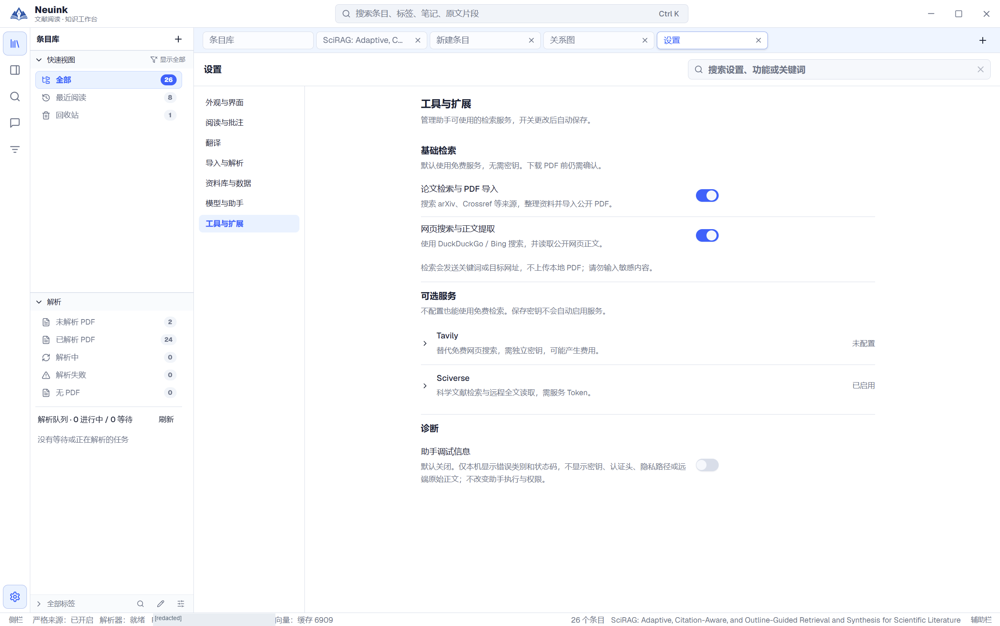

设置按任务分为七类。可以搜索“字体太小”“划词”“模型”“ZIP”等关键词，定位到具体选项，无需在长页面里逐项寻找。

## 按步骤看实际界面

完整窗口截图可点击放大；先看入口，再按图下说明检查结果。服务地址与私人路径已遮挡。

### 1. 调整外观与缩放

打开设置的“外观与界面”，选择界面风格、强调色与缩放。截图使用标准风格，其他风格的业务入口相同。

### 2. 调整阅读交互

在“阅读与批注”中选择悬停预览及其内容。页面可继续滚动；截图展示当前可见的上部设置，不代表全部选项。

### 3. 查看已有模型连接

进入“模型与助手”，检查模型列表及任务分工，再决定新增或编辑连接。截图未展开已有凭据。

### 4. 填写新的模型连接

点击新增模型，按实际服务填写协议、模型、名称、Base URL 与密钥，测试后保存。截图是空白表单，没有可直接复用的密钥。

### 5. 选择研究工具

在“工具与扩展”中核对论文和网页检索开关，以及可选服务配置。查看设置不会自动发起研究任务。

## 七类设置导航

| 分类 | 主要选项 |
| --- | --- |
| 外观与界面 | 标准／拟物／玻璃风格、强调色、界面缩放、降低透明度。 |
| 阅读与批注 | 默认打开 PDF、悬停预览及内容、分段框、片段打开与关闭方式。 |
| 翻译 | 阅读翻译模型、选字自动翻译、解析后自动翻译、内容类型与双语显示。 |
| 导入与解析 | 客户端 ZIP 教程、自建服务 URL 与 API Key、自动解析。 |
| 资料库与数据 | 新建、打开、迁移、最近使用记录和新手引导。 |
| 模型与助手 | 模型连接、参数、连接测试与助手任务模型。 |
| 工具与扩展 | 论文／网页检索、Tavily、Sciverse 与助手诊断。 |

## 创建模型连接

1. 新建模型配置，选择适合服务的 OpenAI-compatible、Anthropic 或 Google 协议。
2. 填写 Base URL、模型 ID 与服务要求的 API Key。
3. 可从公开目录或服务返回的模型列表选择，也可手动输入。
4. 核对上下文、最大输出、Temperature 和 Top P 等参数。
5. 测试并保存，再将它指定给助手或翻译任务。

目录里的模型条目不是本机已安装模型，也不意味着你的账号一定有调用权限。修改提供方或地址后，需要核对凭据是否仍适用；不要把解析服务地址填入模型接口。

## 助手与翻译可以用不同模型

助手对话和阅读翻译有独立选择。可以让擅长工具调用的模型负责研究，用另一模型处理翻译。仅创建一个连接但没有指定任务模型，可能仍无法执行对应任务。

本地模型同样需要正确的服务协议与地址。应用不会因为填写了一个模型名称就下载或启动该模型。

## 外观与缩放

标准、拟物和玻璃风格共享业务功能。强调色影响选择、焦点与主要操作；界面缩放改变应用控件尺寸，而网页缩放和 PDF 缩放分别控制各自内容。

玻璃模式可降低透明度，改善复杂背景下的清晰度。系统减少动态效果或高对比偏好会影响相应视觉效果，但不改变论文和笔记内容。

## 阅读偏好

可让有 PDF 的条目默认直接打开原文，或先显示概览。悬停预览分别控制 PDF 与重排，预览内容可选择原文、译文、笔记与批注。

片段打开方式支持选中后操作、单击或 Alt+单击；浮层关闭可选择点击空白或再次点击当前片段。调整这些选项适合减少误触，而不需要改变资料结构。

## 自动化选项要分别理解

“导入后自动解析”“解析后自动翻译”“选字后自动翻译”处于不同阶段，分别可能触发服务请求。根据实际需要开启，先确认接口和模型正常。

工具凭据保存与工具启用也相互独立。Tavily、Sciverse 等可选服务不会因为你查看设置就自动获得调用授权。

## 当前隐藏的高级配置

主助手高级权限、子助手和 MCP 配置在当前普通设置中隐藏。手册不将这些底层机制描述成可点击的现有设置。功能出现与否以你实际使用的版本为准。
