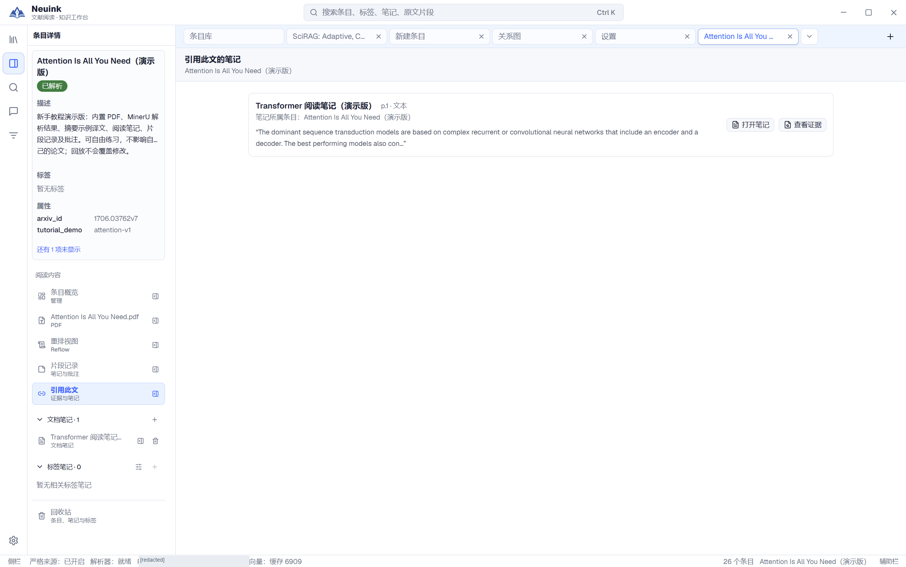
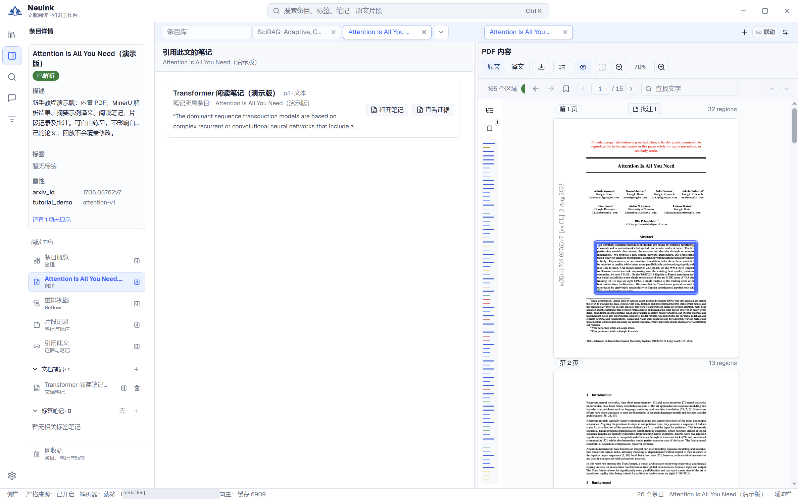
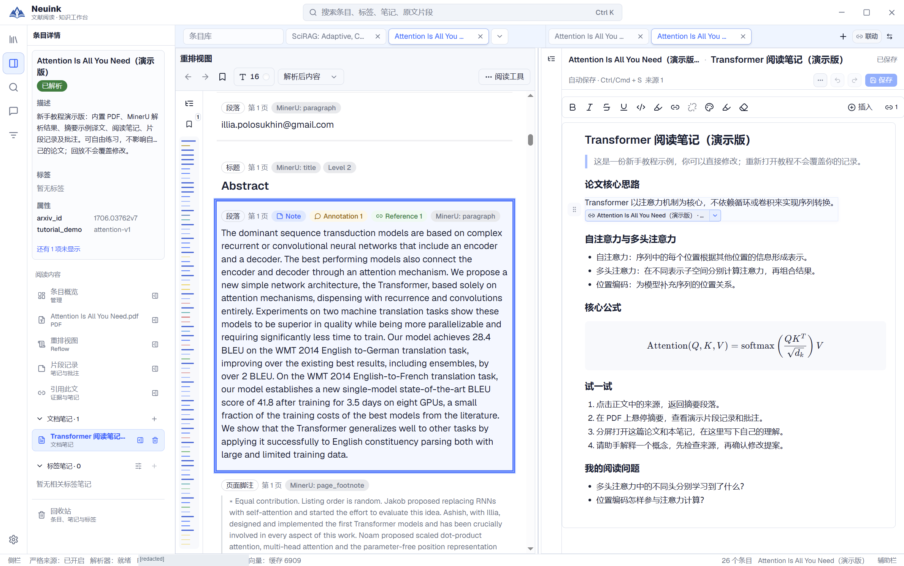

Source Link 将笔记中的结论连接到原始证据。它不仅是一段可点击的文字，还保存来源条目、位置及文本快照，让你之后能判断引用是否仍然有效。

## 按步骤看实际界面

按下面的步骤找到入口，并检查操作结果；点击图片可放大查看。

### 1. 查找哪些笔记引用了本文

在条目详情点击“引用此文”，查看引用笔记、页码与证据摘要。每条结果提供“打开笔记”和“查看证据”。

### 2. 从反向引用查看证据

点击“查看证据”，另一侧打开 PDF 并定位对应原文区域。核对高亮段落与引用摘要是否一致。

### 3. 从笔记返回原文

打开笔记并点击正文中的来源链接，左侧重排定位并突出显示摘要片段。这样可以从结论回到它引用的完整上下文。

## 来源链接保存什么

来源通常记录文献、页码、对应片段和引用时的文字快照。未解析 PDF 的基础文字证据可以是页级来源，没有精确片段框。外部网页证据保留真实 URL，不伪装成本地 PDF 的页码来源。

文本快照让原文暂不可用时仍能查看当时引用的内容，但快照不是原 PDF 的备份。

## 从阅读中插入来源

先打开目标笔记并确认可编辑，再通过阅读器的片段来源操作插入。分屏很适合此流程：一边核对 PDF，一边整理笔记。插入后检查正文中的来源标记，保存笔记。

多篇论文可以共同引用到一篇标签综合笔记。引用不会复制整篇论文，也不会改变笔记的归属标签。

## 预览、定位与反向引用

点击来源可查看快照及状态，通过定位操作回到原文；文档笔记中也可按界面提示使用 Ctrl/Cmd+点击跳转。打开原文时，工作区会尽量复用已有阅读页并保留笔记。

在来源链接与相关详情中查看反向引用，可以回答“哪篇笔记用到了这篇论文”。关系图把这些已经记录的来源关系可视化，并不会因此自动推断文献的学术引用关系。

## 来源不可用时怎么办

| 状态 | 含义与处理 |
| --- | --- |
| 论文在回收站 | 可先恢复论文，再检查定位。 |
| 原条目永久删除 | 快照可能仍可读，但不能保证恢复原文。 |
| 片段缺失 | 重新解析可能改变片段，需人工核对新位置。 |
| 内容变化 | 原快照与当前内容不再完全对应，应核对而不是直接覆盖。 |
| 资源暂不可用 | 检查文件、资料库位置与加载错误，再尝试刷新。 |

恢复或重新解析后会重新检查状态。系统保留旧快照，不将新内容悄悄写进旧引用冒充原证据。

## 分享后还能看懂吗

Markdown 文档笔记可保留可读脚注；Word/TXT 的阅读成果导出使用题名、页码、可用 DOI 和文字快照说明来源。接收人即使没有安装 Neuink，也应能理解出处。

外部来源、页级证据和精确片段证据的粒度不同。写作时保留实际覆盖范围，不能将只读过摘要的检索候选写成“已核对全文”。
