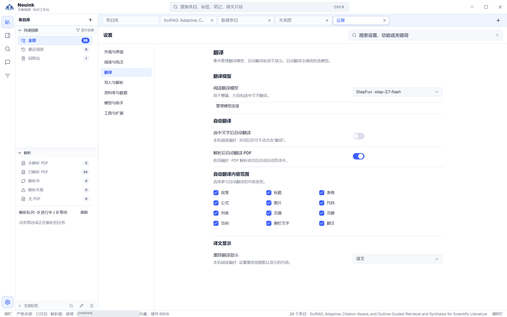
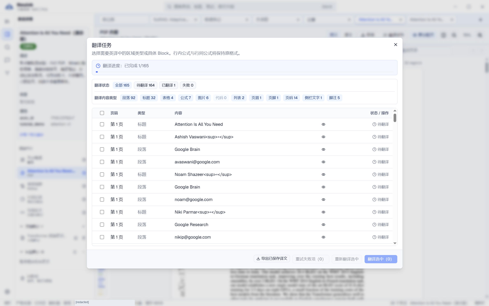
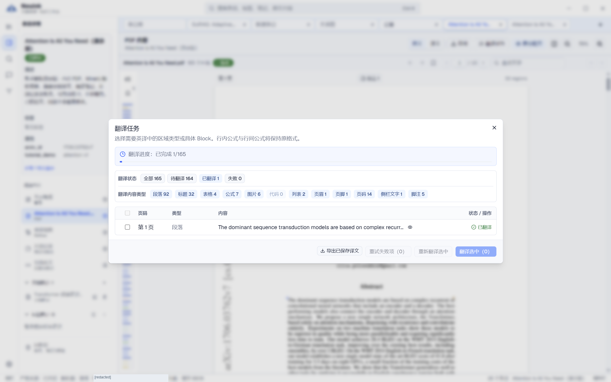

Neuink 将选区、片段和整篇翻译放在同一阅读流程中，但它们的触发范围不同。翻译前先在设置里指定“阅读翻译模型”；助手的对话模型不会自动成为每项任务的唯一模型。

## 按步骤看实际界面

按下面的步骤找到入口，并检查操作结果；点击图片可放大查看。

### 1. 先指定阅读翻译模型

在设置的“翻译”页选择模型，分别核对自动翻译开关、内容类型和显示偏好。

### 2. 打开翻译任务面板

从阅读器工具栏进入翻译任务，核对片段总数、翻译范围与当前状态，再决定启动或继续。演示条目预置了 1 个译文，可用来熟悉任务状态与筛选。

### 3. 筛选已有译文

切换到“已翻译”查看实际保存的片段。不要把一个片段完成理解成整篇完成；返回重排后再选择双语显示。

## 选择适合的翻译范围

| 方式 | 适用情况 | 注意事项 |
| --- | --- | --- |
| 选中文字翻译 | 一个术语、句子或局部段落 | 依赖可选文字，自动触发需单独开启。 |
| 片段翻译 | 一个解析段落、标题或表格 | 绑定片段内容，可在预览或重排中查看。 |
| 全文翻译 | 系统阅读整篇解析内容 | 按内容类型和稳定片段处理，展示任务状态。 |

如果只需要理解一个术语，不必先启动全文任务。长文献的全文翻译需要更多模型请求与时间。

## 启动全文任务

从 PDF／重排的翻译任务入口检查范围，确认翻译模型可用，再开始。正文、标题、图注、表格等是否参与自动翻译由内容范围设置决定；公式、代码与书目信息可能按规则保留。

在任务面板中查看当前状态和失败项，再回到重排选择原文、译文或双语显示。翻译尚未完成时，可继续原文阅读，不必等待整篇结束。

## 暂停、继续和取消

- **暂停**：停止当前执行并保存剩余范围。之后可继续同一个任务，处理尚未完成的片段。
- **继续**：使用原任务配置和范围恢复；如果模型配置或原文已经变化，可能需要先处理提示。
- **取消**：结束本轮任务，已有译文保留。取消后的任务不再继续，需要明确创建新任务。
- **失败重试**：针对失败状态处理，不把已有成功结果当作全篇失败。

已暂停任务可在重新打开条目或应用后恢复。原模型不存在或内容已失效时，应用不会擅自换一个模型继续翻译。

## 自动翻译选项

“选中文字后自动翻译”默认关闭。开启后，日常选字可能向配置的模型发送选区。

“解析后自动翻译 PDF”是另一项开关，可选择参与的内容类型。它与“导入 PDF 后自动解析”并不相同：一个发生在解析成功后，另一个决定是否把新导入的 PDF 提交给解析服务。

## 译文失效与人工检查

译文绑定源内容。重新解析、替换文件或原文变化后，旧译文可能被标记失效；不要把仍能看到旧文字理解成它已匹配新版。

模型可能误译术语、数字或条件关系。图片内文字未经过单独识别与翻译时，不属于完整翻译覆盖。学术结论、表格数值和复杂公式应回到原文核对。

## 导出中文稿或双语稿

从全文导出选择中文译稿或双语稿，检查未译、失效译文和缺图清单。可以确认后输出草稿，但草稿应保留问题说明。支持的格式是 DOCX、TXT 与 Markdown 资料包，不是直接生成排好版的中文 PDF。

生成内部双语笔记与导出独立完整译稿是两种操作，具体见[导出格式表](export.md)。
