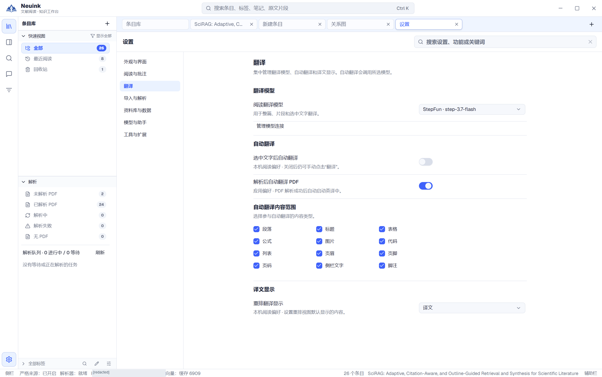
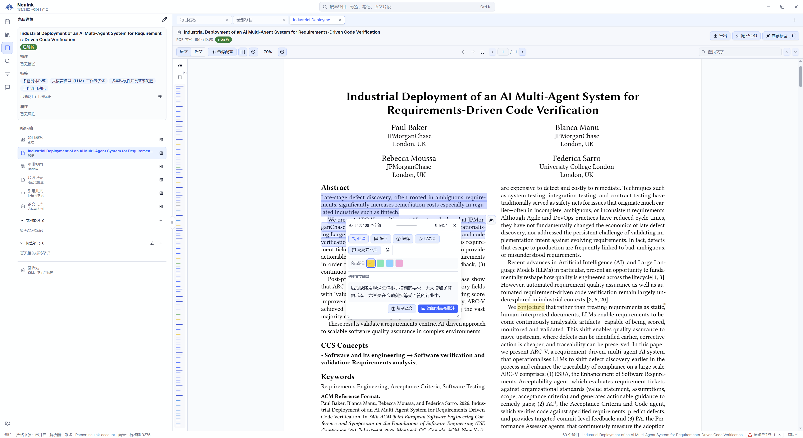
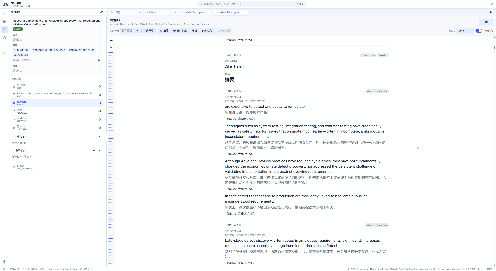
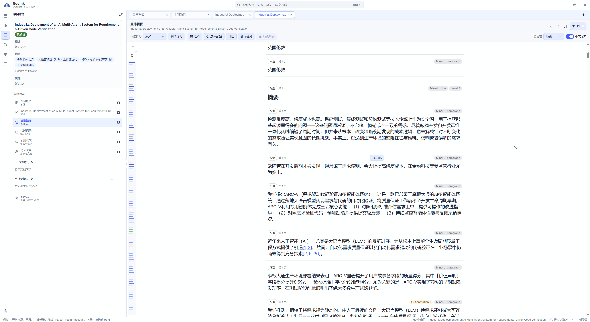
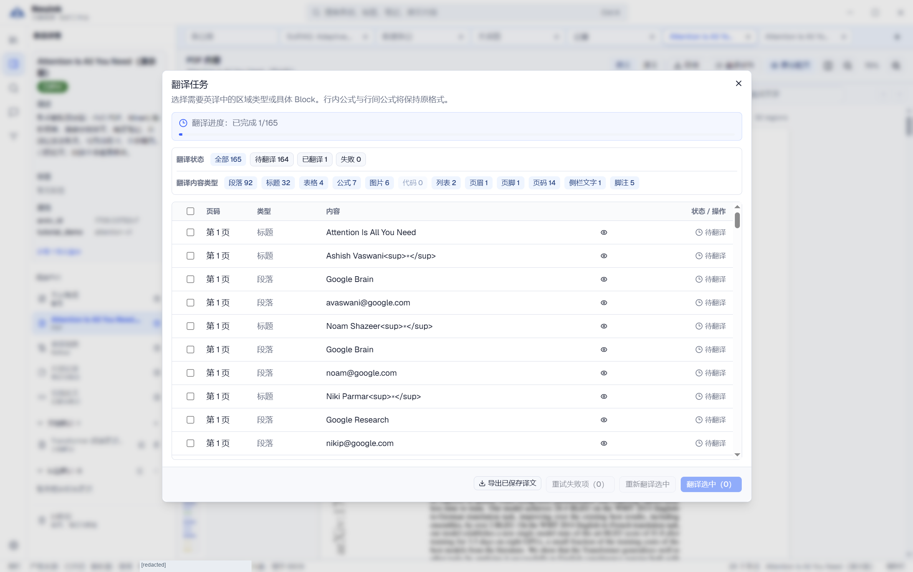
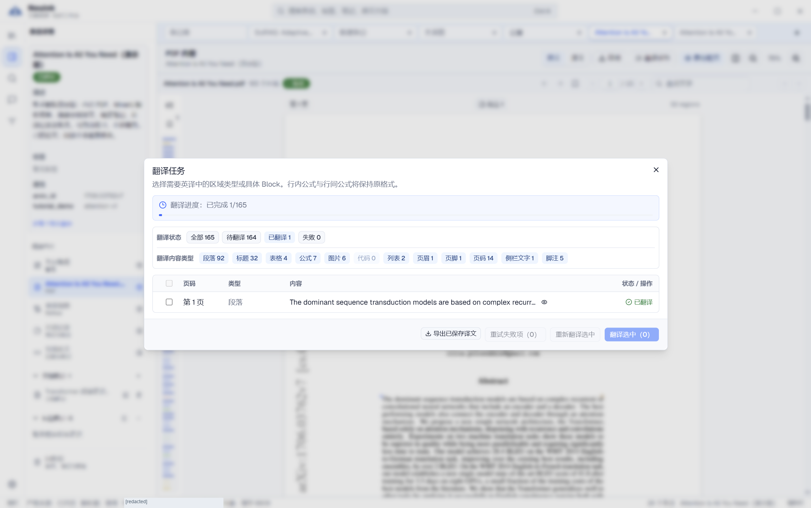

Neuink 将选区、片段和整篇翻译放在同一阅读流程中，但它们的触发范围不同。可统一选择小牛翻译、DeepL、Azure、Qwen-MT 或模型；每个翻译场景也可单独设置来源。

## 推荐先配置小牛翻译

在“设置 → 翻译”展开小牛翻译，填写自己的 API Key，点击“验证并保存”。然后在翻译行为中统一选择小牛，或分别为单词、选区、片段、逐句和整篇设置来源。它是推荐搭配，DeepL、Azure、Qwen-MT 和自定义大模型仍可选择。

Azure 需填写服务区域，DeepL 需匹配账户地址，Qwen-MT 需匹配模型与地域。大模型连接复用“模型与助手”中的配置。各服务的权限、额度和计费由对应服务账户决定。

## 从选区开始翻译

在 PDF 选中文字，点击翻译，查看译文或将其加入高亮批注。一个单词、一句话或局部段落无需先启动全文任务。

## 原文、译文与双语阅读

PDF 可以保留原版式阅读译文，也可以把原文与译文放在左右分栏。重排视图则分别控制源语言与中文译文：整段中英对照、逐句配对或隐藏原文只读中文。

## 查看全文翻译任务

从阅读器工具栏进入翻译任务，检查范围、进度与每个片段的状态，可筛选已有译文、暂停、继续或重试失败项。以下保留较早版本的任务面板示例，当前界面布局可能不同。

## 选择适合的翻译范围

| 方式 | 适用情况 | 注意事项 |
| --- | --- | --- |
| 选中文字翻译 | 一个术语、句子或局部段落 | 依赖可选文字，自动触发需单独开启。 |
| 片段翻译 | 一个解析段落、标题或表格 | 绑定片段内容，可在预览或重排中查看。 |
| 全文翻译 | 系统阅读整篇解析内容 | 按内容类型和稳定片段处理，展示任务状态。 |

如果只需要理解一个术语，不必先启动全文任务。长文献的全文翻译需要更多模型请求与时间。

## 统一或分别设置来源

“统一翻译来源”一次设置五类入口；下方可分别设置单词、选中文字、单片段、段落逐句与整篇批量。服务和模型可以混用。单词优先本地词库可独立关闭；阅读详略的中文译文沿用段落来源，生成详略仍使用助手模型。

四家专用服务各自保存配置和密钥。验证仅发送固定示例，成功后才保存；密钥存于本机凭据库，不显示已有值。服务失败明确提示，不自动切换来源。当前目标为简体中文，收费以服务商账户为准。

## 启动全文任务

从 PDF／重排的翻译任务入口检查范围，确认所选翻译服务或模型可用，再开始。正文、标题、图注、表格等是否参与自动翻译由内容范围设置决定；公式、代码与书目信息可能按规则保留。

在任务面板中查看当前状态和失败项，再回到重排选择原文、译文或双语显示。翻译尚未完成时，可继续原文阅读，不必等待整篇结束。

## 暂停、继续和取消

- **暂停**：停止当前执行并保存剩余范围。之后可继续同一个任务，处理尚未完成的片段。
- **继续**：使用原任务配置和范围恢复；如果服务／模型配置或原文已经变化，可能需要先处理提示。
- **取消**：结束本轮任务，已有译文保留。取消后的任务不再继续，需要明确创建新任务。
- **失败重试**：针对失败状态处理，不把已有成功结果当作全篇失败。

已暂停任务可在重新打开条目或应用后恢复。原服务配置变化、模型不存在或内容已失效时，应用不会擅自换一个来源继续翻译。

## 自动翻译选项

“选中文字后自动翻译”默认关闭。开启后，日常选字可能向配置的选区翻译服务发送选区。

“解析后自动翻译 PDF”是另一项开关，可选择参与的内容类型。它与“导入 PDF 后自动解析”并不相同：一个发生在解析成功后，另一个决定是否把新导入的 PDF 提交给解析服务。

## 译文失效与人工检查

译文绑定源内容。重新解析、替换文件或原文变化后，旧译文可能被标记失效；不要把仍能看到旧文字理解成它已匹配新版。

模型可能误译术语、数字或条件关系。图片内文字未经过单独识别与翻译时，不属于完整翻译覆盖。学术结论、表格数值和复杂公式应回到原文核对。

## 导出中文稿或双语稿

从全文导出选择中文译稿或双语稿，检查未译、失效译文和缺图清单。可以确认后输出草稿，但草稿应保留问题说明。支持的格式是 DOCX、TXT 与 Markdown 资料包，不是直接生成排好版的中文 PDF。

生成内部双语笔记与导出独立完整译稿是两种操作，具体见[导出格式表](export.md)。

普通正文按 MinerU 解析片段整体翻译；只有超过请求预算时才按安全句界分块，完成后仍保存为同一个片段译文。逐句对照复用这份译文在本地切分、对齐，不因切换显示方式增加翻译请求；无法可靠配对时保留句组或整段。长片段已完成子块保存在本地，失败后重试复用。
